# ATR Module Flowcharts (GitHub Mermaid)

## 01_atr_overview_and_navigation.md

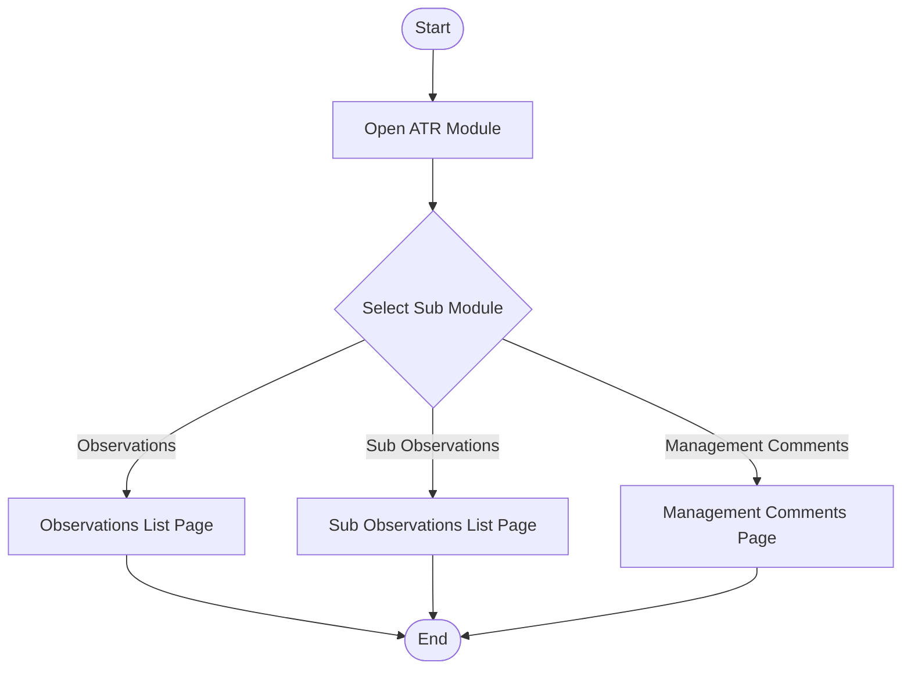

## 02_atr_observations_list_and_filters.md

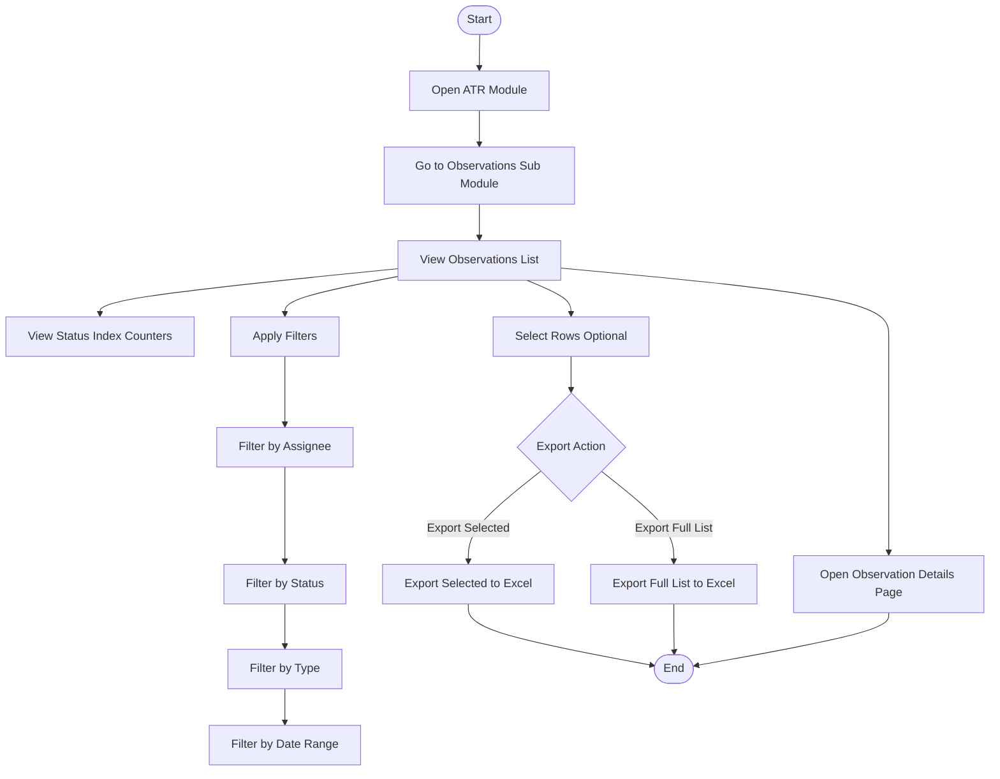

## 03_atr_observations_manual_creation.md

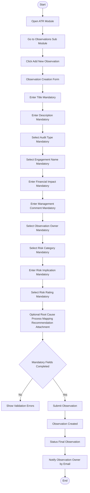

## 04_atr_observations_bulk_import.md

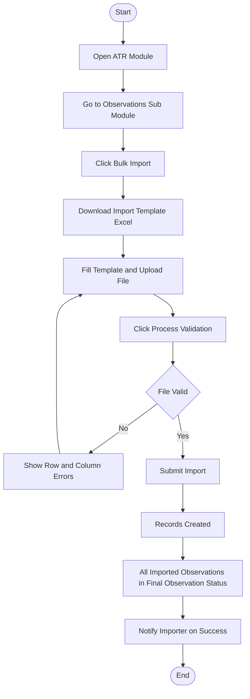

## 05_ia_to_atr_sync_flow.md

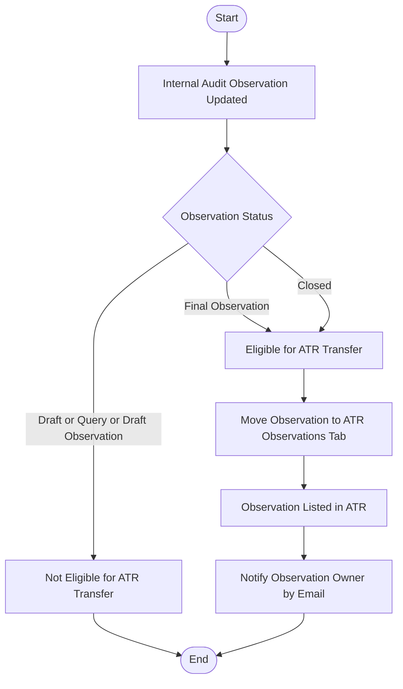

## 06_atr_observation_detail_and_actions.md

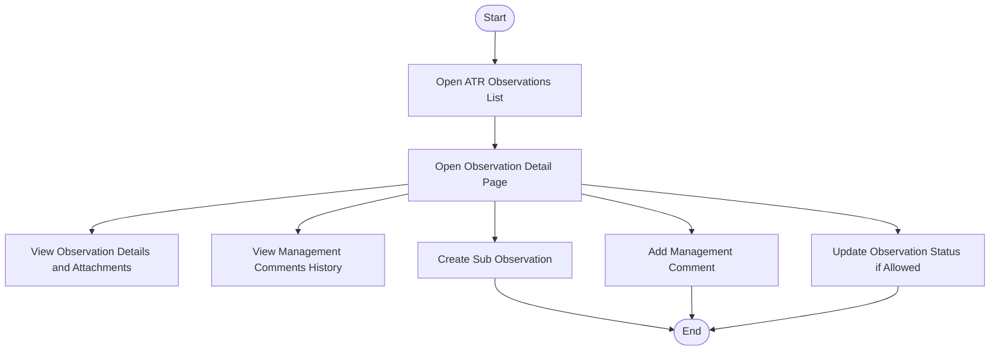

## 07_atr_sub_observations_list_and_filters.md

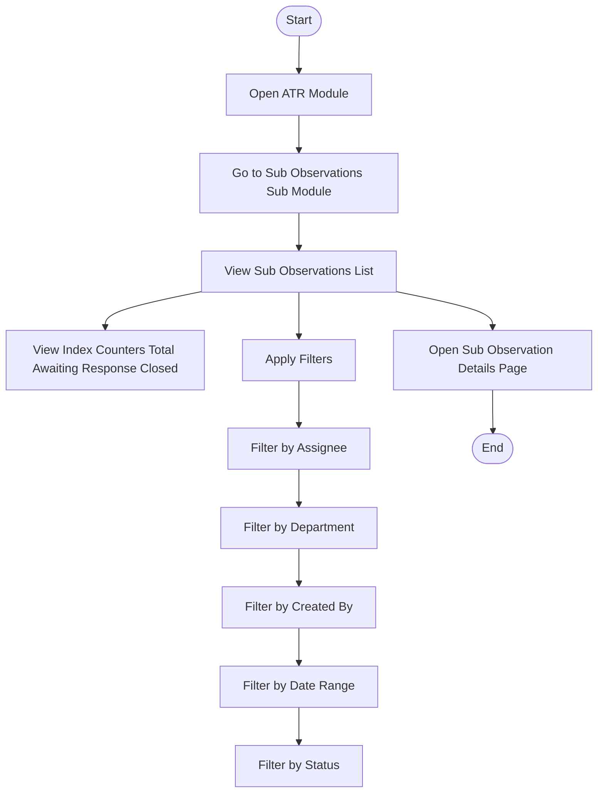

## 08_atr_sub_observation_creation.md

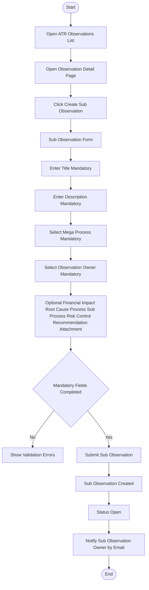

## 09_atr_sub_observation_status_workflow.md

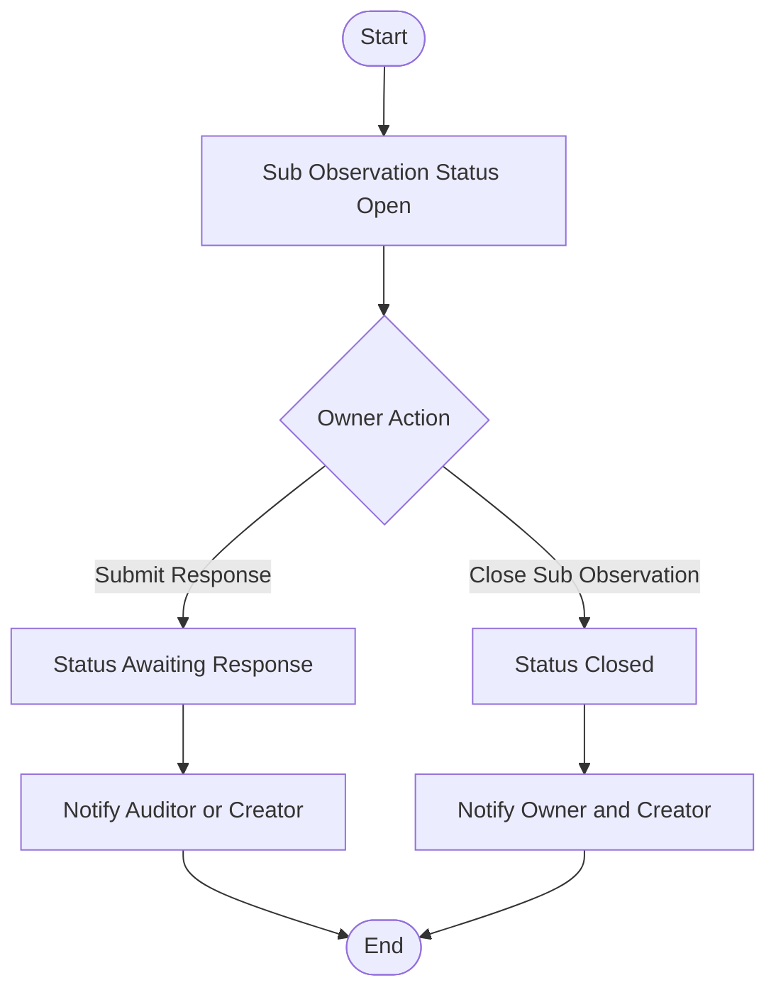

## 10_atr_management_comments_flow.md

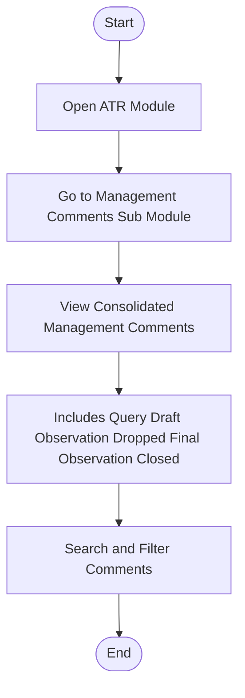

## 11_atr_notifications_overview.md

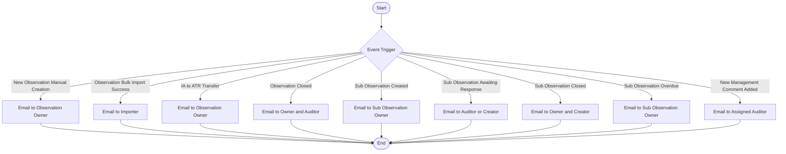

## 99_atr_full_end_to_end.md

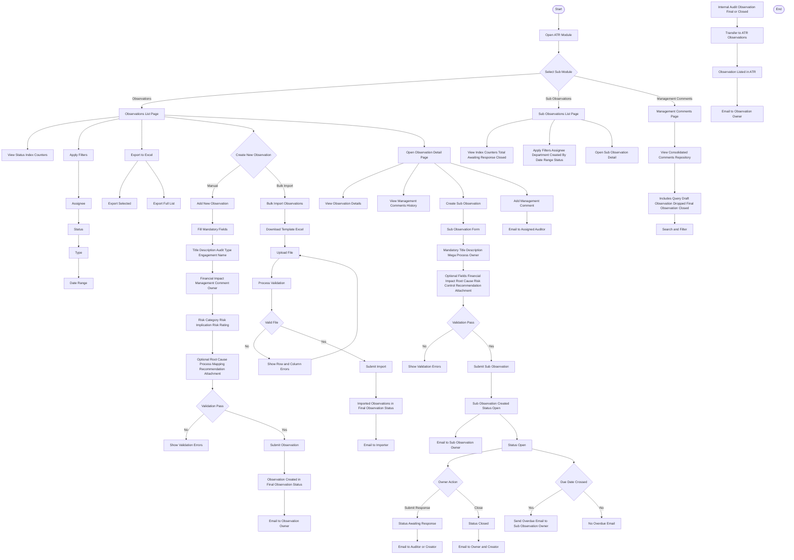

