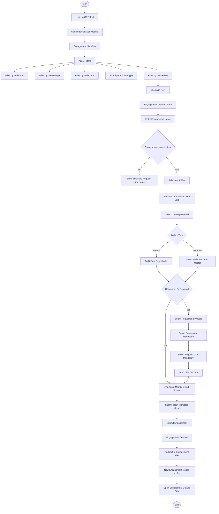

```mermaid
flowchart TD

%% ==========================================
%% ENGAGEMENT LIST + ENGAGEMENT CREATION FLOW
%% ==========================================

S0([Start]) --> S1[Login to GRC Tool]
S1 --> S2[Open Internal Audit Module]
S2 --> S3[Engagement List View]

S3 --> S4[Apply Filters]
S4 --> S4A[Filter by Audit Plan]
S4 --> S4B[Filter by Date Range]
S4 --> S4C[Filter by Audit Type]
S4 --> S4D[Filter by Audit Sub-type]
S4 --> S4E[Filter by Created By]
S4E --> S5[Click Add New]

S5 --> F1[Engagement Creation Form]

F1 --> F2[Enter Engagement Name]
F2 --> V1{Engagement Name Unique}
V1 -->|No| V1E[Show Error and Request New Name]
V1 -->|Yes| F3[Select Audit Plan]
F3 --> F4[Select Audit Start and End Date]
F4 --> F5[Select Coverage Period]

F5 --> A1{Auditor Type}
A1 -->|Internal| A2[Audit Firm Field Hidden]
A1 -->|External| A3[Select Audit Firm from Master]

A2 --> RB1{Requested By Selected}
A3 --> RB1

RB1 -->|No| TM1[Add Team Members and Roles]
RB1 -->|Yes| RB2[Select Requested By Users]
RB2 --> RB3[Select Department Mandatory]
RB3 --> RB4[Select Request Date Mandatory]
RB4 --> RB5[Attach File Optional]
RB5 --> TM1

TM1 --> TM2[Submit Team Members Modal]
TM2 --> SUB1[Submit Engagement]
SUB1 --> SUB2[Engagement Created]
SUB2 --> SUB3[Redirect to Engagement List]
SUB3 --> SUB4[New Engagement Visible on Top]
SUB4 --> SUB5[Open Engagement Details Tab]
SUB5 --> End([End])

```
