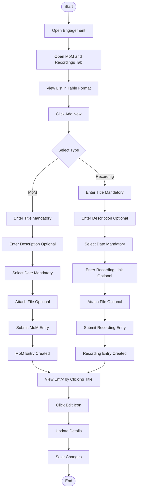

```mermaid
flowchart TD

%% ======================================
%% MOM AND RECORDINGS TAB FLOW
%% ======================================

S0([Start]) --> S1[Open Engagement]
S1 --> S2[Open MoM and Recordings Tab]
S2 --> S3[View List in Table Format]

S3 --> S4[Click Add New]
S4 --> S5{Select Type}

%% MoM
S5 -->|MoM| M1[Enter Title Mandatory]
M1 --> M2[Enter Description Optional]
M2 --> M3[Select Date Mandatory]
M3 --> M4[Attach File Optional]
M4 --> M5[Submit MoM Entry]
M5 --> M6[MoM Entry Created]

%% Recording
S5 -->|Recording| R1[Enter Title Mandatory]
R1 --> R2[Enter Description Optional]
R2 --> R3[Select Date Mandatory]
R3 --> R4[Enter Recording Link Optional]
R4 --> R5[Attach File Optional]
R5 --> R6[Submit Recording Entry]
R6 --> R7[Recording Entry Created]

%% View and Edit
M6 --> V1[View Entry by Clicking Title]
R7 --> V1
V1 --> E1[Click Edit Icon]
E1 --> E2[Update Details]
E2 --> E3[Save Changes]

E3 --> End([End])
```
