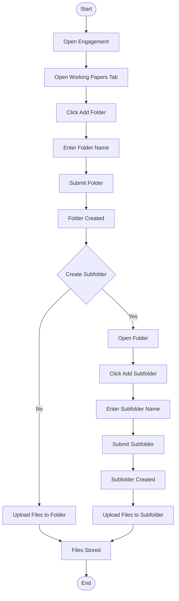

```mermaid
flowchart TD

%% ======================================
%% WORKING PAPERS TAB FLOW
%% ======================================

S0([Start]) --> S1[Open Engagement]
S1 --> S2[Open Working Papers Tab]

S2 --> S3[Click Add Folder]
S3 --> S4[Enter Folder Name]
S4 --> S5[Submit Folder]
S5 --> S6[Folder Created]

S6 --> D1{Create Subfolder}
D1 -->|No| U1[Upload Files to Folder]
D1 -->|Yes| SF1[Open Folder]
SF1 --> SF2[Click Add Subfolder]
SF2 --> SF3[Enter Subfolder Name]
SF3 --> SF4[Submit Subfolder]
SF4 --> SF5[Subfolder Created]
SF5 --> U2[Upload Files to Subfolder]

U1 --> Done[Files Stored]
U2 --> Done
Done --> End([End])
```
