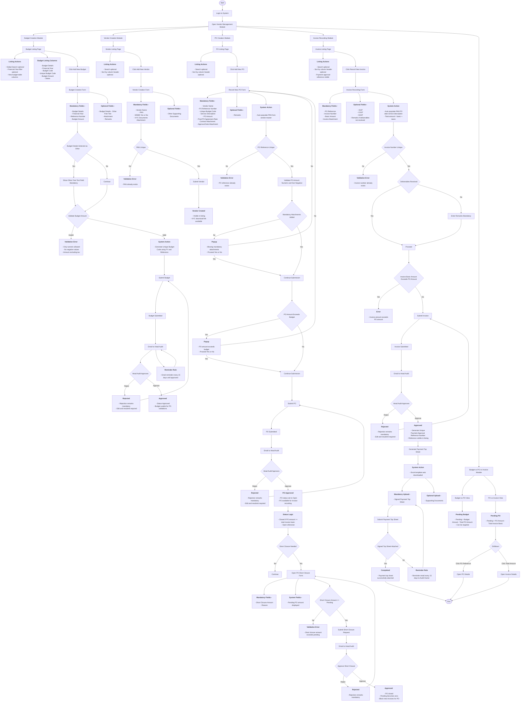

```mermaid
flowchart TD

%% ==========================================================
%% VENDOR MANAGEMENT - FULL END TO END FLOW (CLEAN FORMAT)
%% ==========================================================

START([Start]) --> A1[Login to System]
A1 --> A2[Open Vendor Management Module]

%% ----------------------------------------------------------
%% BUDGET CREATION
%% ----------------------------------------------------------
A2 --> B1[Budget Creation Module]
B1 --> B2[Budget Listing Page]

B2 --> B2A["<b>Listing Actions</b><br/><br/>- Global Search optional<br/>- Financial Year filter optional<br/>- View budget table columns"]
B2 --> B2B["<b>Budget Listing Columns</b><br/><br/>- Budget Details<br/>- Financial Year<br/>- Budget Code<br/>- Unique Budget Code<br/>- Budget Amount<br/>- Status"]

B2 --> B3[Click Add New Budget]
B3 --> B4[Budget Creation Form]

B4 --> B4M["<b>Mandatory Fields:-</b><br/><br/>- Budget Details<br/>- Financial Year<br/>- Reference Number<br/>- Budget Amount"]
B4 --> B4O["<b>Optional Fields:-</b><br/><br/>- Budget Details - Other Free Text<br/>- Attachment<br/>- Remarks"]

B4M --> B5{Budget Details Selected as Other}
B5 -->|Yes| B6[Show Other Free Text Field Mandatory]
B5 -->|No| B7[Continue]

B6 --> B8{Validate Budget Amount}
B7 --> B8

B8 -->|Invalid| B9["<b>Validation Error</b><br/><br/>- Only numeric allowed<br/>- No negative values<br/>- Amount excluding tax"]
B8 -->|Valid| B10["<b>System Action</b><br/><br/>- Generate Unique Budget Code using FY and Reference"]

B10 --> B11[Submit Budget]
B11 --> B12[Budget Submitted]

%% Budget Approval
B12 --> B13[Email to Head Audit]
B13 --> B14{Head Audit Approves}
B14 -->|Reject| B15["<b>Rejected</b><br/><br/>- Rejection remarks mandatory<br/>- Edit and resubmit required"]
B15 --> B11
B14 -->|Approve| B16["<b>Approved</b><br/><br/>- Status Approved<br/>- Budget usable for PO validations"]

B13 --> B17["<b>Reminder Rule</b><br/><br/>- Email reminder every 15 days until approved"]
B17 --> B13


%% ----------------------------------------------------------
%% VENDOR CREATION
%% ----------------------------------------------------------
A2 --> V1[Vendor Creation Module]
V1 --> V2[Vendor Listing Page]

V2 --> V2A["<b>Listing Actions</b><br/><br/>- Search optional<br/>- Sort by column header optional"]
V2 --> V3[Click Add New Vendor]
V3 --> V4[Vendor Creation Form]

V4 --> V4M["<b>Mandatory Fields:-</b><br/><br/>- Vendor Name<br/>- PAN<br/>- MSME Yes or No<br/>- KYC Documents Attachment"]
V4 --> V4O["<b>Optional Fields:-</b><br/><br/>- Other Supporting Documents"]

V4M --> V5{PAN Unique}
V5 -->|No| V6["<b>Validation Error</b><br/><br/>- PAN already exists"]
V5 -->|Yes| V7[Submit Vendor]
V7 --> V8["<b>Vendor Created</b><br/><br/>- Visible in listing<br/>- KYC download link available"]


%% ----------------------------------------------------------
%% PO CREATION
%% ----------------------------------------------------------
A2 --> P1[PO Creation Module]
P1 --> P2[PO Listing Page]

P2 --> P2A["<b>Listing Actions</b><br/><br/>- Search optional<br/>- Sort by column header optional"]
P2 --> P3[Click Add New PO]
P3 --> P4[Record New PO Form]

P4 --> P4M["<b>Mandatory Fields:-</b><br/><br/>- Vendor Name<br/>- PO Reference Number<br/>- Unique Budget Code<br/>- Service Description<br/>- PO Amount<br/>- Final PO Agreement Rate Contract Attachment<br/>- Approval Note Attachment"]
P4 --> P4O["<b>Optional Fields:-</b><br/><br/>- Remarks"]

P4 --> P5["<b>System Action</b><br/><br attaching??/><br/>- Auto populate PAN from vendor master"]
P5 --> P6{PO Reference Unique}
P6 -->|No| P7["<b>Validation Error</b><br/><br/>- PO reference already exists"]
P6 -->|Yes| P8[Validate PO Amount Numeric and Non Negative]

P8 --> P9{Mandatory Attachments Added}
P9 -->|No| P10["<b>Popup</b><br/><br/>- Missing mandatory attachments<br/>- Proceed Yes or No"]
P10 -->|No| P4
P10 -->|Yes| P11[Continue Submission]
P9 -->|Yes| P11

P11 --> P12{PO Amount Exceeds Budget}
P12 -->|Yes| P13["<b>Popup</b><br/><br/>- PO amount exceeds budget<br/>- Proceed Yes or No"]
P13 -->|No| P4
P13 -->|Yes| P14[Continue Submission]
P12 -->|No| P14

P14 --> P15[Submit PO]
P15 --> P16[PO Submitted]

%% PO Approval
P16 --> P17[Email to Head Audit]
P17 --> P18{Head Audit Approves}
P18 -->|Reject| P19["<b>Rejected</b><br/><br/>- Rejection remarks mandatory<br/>- Edit and resubmit required"]
P19 --> P15
P18 -->|Approve| P20["<b>PO Approved</b><br/><br/>- PO status set to Open<br/>- PO available for invoice recording"]

%% PO Status Auto Update
P20 --> P21["<b>Status Logic</b><br/><br/>- Closed if PO amount >= total invoice basic<br/>- Open otherwise"]

%% PO Short Closure
P21 --> SC1{Short Closure Needed}
SC1 -->|No| NEXT1[Continue]
SC1 -->|Yes| SC2[Open PO Short Closure Form]

SC2 --> SC2M["<b>Mandatory Fields:-</b><br/><br/>- Short Closure Amount<br/>- Reason"]
SC2 --> SC2S["<b>System Fields:-</b><br/><br/>- Pending PO amount displayed"]

SC2 --> SC3{Short Closure Amount <= Pending}
SC3 -->|No| SC4["<b>Validation Error</b><br/><br/>- Short closure amount exceeds pending"]
SC3 -->|Yes| SC5[Submit Short Closure Request]
SC5 --> SC6[Email to Head Audit]
SC6 --> SC7{Approve Short Closure}
SC7 -->|Reject| SC8["<b>Rejected</b><br/><br/>- Rejection remarks mandatory"]
SC8 --> SC2
SC7 -->|Approve| SC9["<b>Approved</b><br/><br/>- PO closed<br/>- Pending becomes zero<br/>- Block new invoices for PO"]


%% ----------------------------------------------------------
%% INVOICE RECORDING
%% ----------------------------------------------------------
A2 --> I1[Invoice Recording Module]
I1 --> I2[Invoice Listing Page]

I2 --> I2A["<b>Listing Actions</b><br/><br/>- Search optional<br/>- Sort by column header optional<br/>- Payment approval reference visible"]
I2 --> I3[Click Record New Invoice]
I3 --> I4[Invoice Recording Form]

I4 --> I4M["<b>Mandatory Fields:-</b><br/><br/>- PO Reference<br/>- Invoice Number<br/>- Basic Amount<br/>- Invoice Attachment"]
I4 --> I4O["<b>Optional Fields:-</b><br/><br/>- IGST<br/>- CGST<br/>- SGST<br/>- Remarks if deliverables not received"]

I4 --> I5["<b>System Action</b><br/><br/>- Auto populate PAN PO date service description<br/>- Total amount = basic + taxes"]
I5 --> I6{Invoice Number Unique}
I6 -->|No| I7["<b>Validation Error</b><br/><br/>- Invoice number already exists"]
I6 -->|Yes| I8{Deliverables Received}

I8 -->|Yes| I9[Proceed]
I8 -->|No| I10[Enter Remarks Mandatory]
I10 --> I9

I9 --> I11{Invoice Basic Amount Exceeds PO Amount}
I11 -->|Yes| I12["<b>Error</b><br/><br/>- Invoice amount exceeds PO amount"]
I11 -->|No| I13[Submit Invoice]
I13 --> I14[Invoice Submitted]

%% Invoice Approval + Payment Reference
I14 --> I15[Email to Head Audit]
I15 --> I16{Head Audit Approves}
I16 -->|Reject| I17["<b>Rejected</b><br/><br/>- Rejection remarks mandatory<br/>- Edit and resubmit required"]
I17 --> I13
I16 -->|Approve| I18["<b>Approved</b><br/><br/>- Generate Unique Payment Approval Reference Number<br/>- Reference visible in listing"]


%% ----------------------------------------------------------
%% PAYMENT TOP SHEET
%% ----------------------------------------------------------
I18 --> PT1[Generate Payment Top Sheet]
PT1 --> PT2["<b>System Action</b><br/><br/>- Excel template auto downloaded"]

PT2 --> PT3["<b>Mandatory Upload:-</b><br/><br/>- Signed Payment Top Sheet"]
PT2 --> PT4["<b>Optional Upload:-</b><br/><br/>- Supporting Documents"]

PT3 --> PT5[Submit Payment Top Sheet]
PT5 --> PT6{Signed Top Sheet Attached}
PT6 -->|Yes| PT7["<b>Completed</b><br/><br/>- Payment top sheet successfully attached"]
PT6 -->|No| PT8["<b>Reminder Rule</b><br/><br/>- Reminder email every 15 days to Audit Owner"]
PT8 --> PT3


%% ----------------------------------------------------------
%% DASHBOARD VIEWS
%% ----------------------------------------------------------
A2 --> D1[Budget vs PO vs Invoice Module]

D1 --> D2[Budget vs PO View]
D2 --> D2A["<b>Pending Budget</b><br/><br/>- Pending = Budget Amount - Total PO Amount<br/>- Can be negative"]

D1 --> D3[PO vs Invoice View]
D3 --> D3A["<b>Pending PO</b><br/><br/>- Pending = PO Amount - Total Invoice Basic"]
D3A --> D4{Drilldown}
D4 -->|Click PO Reference| D5[Open PO Details]
D4 -->|Click Total Amount| D6[Open Invoice Details]

PT7 --> END([End])
D5 --> END
D6 --> END
```
