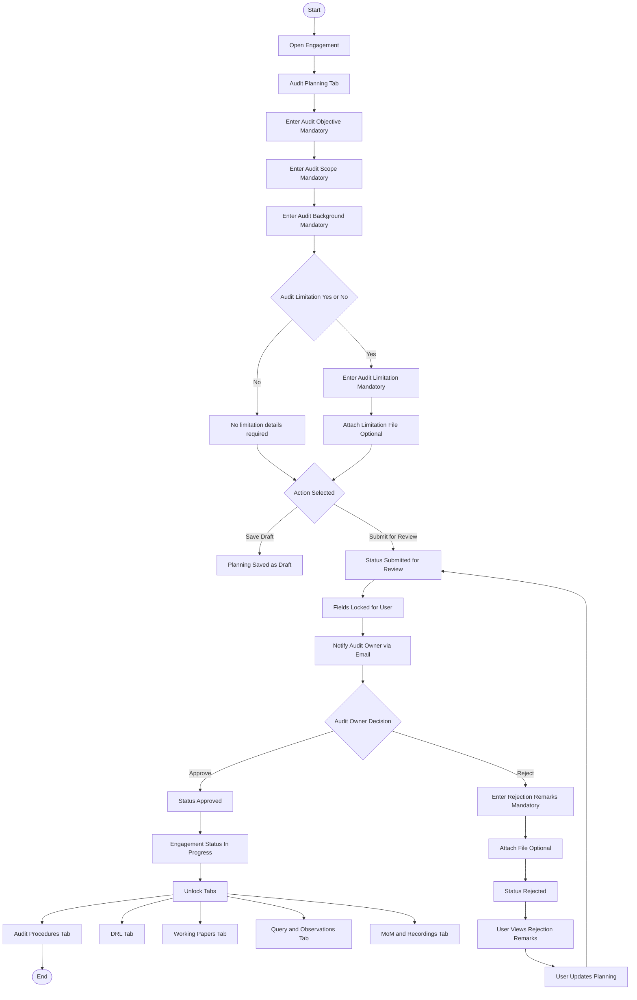

```mermaid
flowchart TD

%% ======================================
%% AUDIT PLANNING + REVIEW WORKFLOW
%% ======================================

A0([Start]) --> A1[Open Engagement]
A1 --> A2[Audit Planning Tab]

A2 --> A3[Enter Audit Objective Mandatory]
A3 --> A4[Enter Audit Scope Mandatory]
A4 --> A5[Enter Audit Background Mandatory]

A5 --> A6{Audit Limitation Yes or No}
A6 -->|No| A7[No limitation details required]
A6 -->|Yes| A8[Enter Audit Limitation Mandatory]
A8 --> A9[Attach Limitation File Optional]
A7 --> A10{Action Selected}
A9 --> A10

A10 -->|Save Draft| A11[Planning Saved as Draft]
A10 -->|Submit for Review| A12[Status Submitted for Review]
A12 --> A13[Fields Locked for User]
A13 --> A14[Notify Audit Owner via Email]

A14 --> R1{Audit Owner Decision}
R1 -->|Approve| R2[Status Approved]
R1 -->|Reject| R3[Enter Rejection Remarks Mandatory]
R3 --> R4[Attach File Optional]
R4 --> R5[Status Rejected]

R5 --> U1[User Views Rejection Remarks]
U1 --> U2[User Updates Planning]
U2 --> A12

R2 --> ST1[Engagement Status In Progress]
ST1 --> UN1[Unlock Tabs]
UN1 --> UN2[Audit Procedures Tab]
UN1 --> UN3[DRL Tab]
UN1 --> UN4[Working Papers Tab]
UN1 --> UN5[Query and Observations Tab]
UN1 --> UN6[MoM and Recordings Tab]

UN2 --> End([End])
``` 
