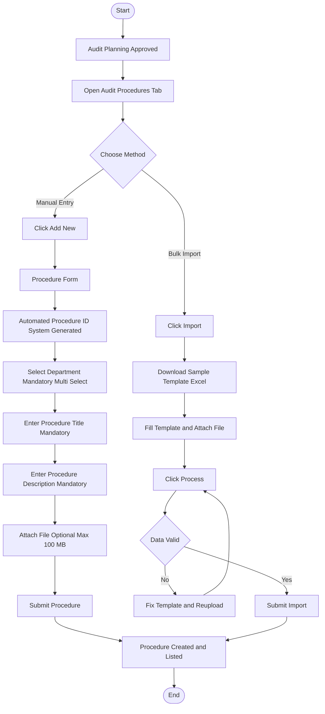

```mermaid
flowchart TD

%% ======================================
%% AUDIT PROCEDURE CREATION WORKFLOW
%% ======================================

S0([Start]) --> S1[Audit Planning Approved]
S1 --> S2[Open Audit Procedures Tab]
S2 --> M1{Choose Method}

%% Manual Entry
M1 -->|Manual Entry| M2[Click Add New]
M2 --> M3[Procedure Form]
M3 --> M4[Automated Procedure ID System Generated]
M4 --> M5[Select Department Mandatory Multi Select]
M5 --> M6[Enter Procedure Title Mandatory]
M6 --> M7[Enter Procedure Description Mandatory]
M7 --> M8[Attach File Optional Max 100 MB]
M8 --> M9[Submit Procedure]
M9 --> M10[Procedure Created and Listed]

%% Bulk Import
M1 -->|Bulk Import| B1[Click Import]
B1 --> B2[Download Sample Template Excel]
B2 --> B3[Fill Template and Attach File]
B3 --> B4[Click Process]
B4 --> V1{Data Valid}
V1 -->|No| V2[Fix Template and Reupload]
V2 --> B4
V1 -->|Yes| B5[Submit Import]
B5 --> M10

M10 --> End([End])

```
