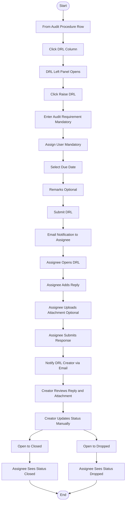

```mermaid
flowchart TD

%% ======================================
%% DRL CREATION + RESPONSE WORKFLOW
%% ======================================

S0([Start]) --> S1[From Audit Procedure Row]
S1 --> S2[Click DRL Column]
S2 --> S3[DRL Left Panel Opens]
S3 --> S4[Click Raise DRL]

S4 --> S5[Enter Audit Requirement Mandatory]
S5 --> S6[Assign User Mandatory]
S6 --> S7[Select Due Date]
S7 --> S8[Remarks Optional]
S8 --> S9[Submit DRL]

S9 --> N1[Email Notification to Assignee]
N1 --> A1[Assignee Opens DRL]
A1 --> A2[Assignee Adds Reply]
A2 --> A3[Assignee Uploads Attachment Optional]
A3 --> A4[Assignee Submits Response]

A4 --> N2[Notify DRL Creator via Email]
N2 --> C1[Creator Reviews Reply and Attachment]
C1 --> C2[Creator Updates Status Manually]
C2 --> C3[Open to Closed]
C2 --> C4[Open to Dropped]

C3 --> V1[Assignee Sees Status Closed]
C4 --> V2[Assignee Sees Status Dropped]

V1 --> End([End])
V2 --> End

```
