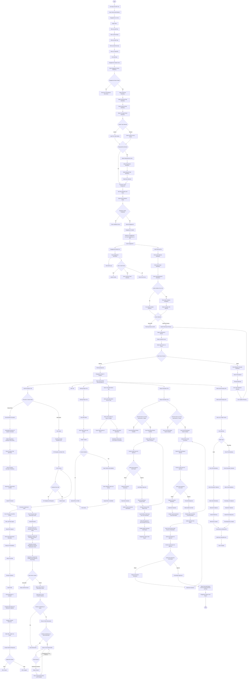

```mermaid
flowchart TD

%% ==========================================================
%% INTERNAL AUDIT MODULE - FULL END TO END FLOW
%% GitHub Mermaid Compatible
%% Based on IA Module PRD
%% ==========================================================

%% ----------------------------------------------------------
%% ENTRY + ENGAGEMENT LIST
%% ----------------------------------------------------------
START([Start]) --> L1[User logs into GRC Tool]
L1 --> L2[Open Internal Audit Module]
L2 --> L3[Engagement List View]

L3 --> L4[Apply Filters]
L4 --> L4A[Filter by Audit Plan]
L4A --> L4B[Filter by Date Range]
L4B --> L4C[Filter by Audit Type]
L4C --> L4D[Filter by Audit Sub Type]
L4D --> L4E[Filter by Created By]
L4E --> L5[Click Add New]

%% ----------------------------------------------------------
%% ENGAGEMENT CREATION FORM + CONDITIONAL LOGIC
%% ----------------------------------------------------------
L5 --> EC1[Engagement Creation Form]

EC1 --> EC2[Enter Engagement Name Mandatory]
EC2 --> EC3{Engagement Name Unique}
EC3 -->|No| EC3E[Show Error and Request New Name]
EC3 -->|Yes| EC4[Select Audit Plan Mandatory]
EC4 --> EC5[Select Audit Start Date Mandatory]
EC5 --> EC6[Select Audit End Date Mandatory]
EC6 --> EC7[Select Coverage Period Mandatory]

EC7 --> EC8{Auditor Type Selected}
EC8 -->|Internal| EC9[Audit Firm Field Hidden]
EC8 -->|External| EC10[Select Audit Firm from Master]

EC9 --> EC11{Requested By Selected}
EC10 --> EC11

EC11 -->|No| EC20[Proceed to Team Assignment]
EC11 -->|Yes| EC12[Select Requested By Users]
EC12 --> EC13[Select Department Mandatory]
EC13 --> EC14[Select Request Date Mandatory]
EC14 --> EC15[Attachment Optional]
EC15 --> EC20

EC20 --> EC21[Add Team Members and Roles]
EC21 --> EC22[Submit Team Members Modal]
EC22 --> EC23{Mandatory Fields Completed}
EC23 -->|No| EC23E[Show Validation Errors]
EC23 -->|Yes| EC24[Submit Engagement]
EC24 --> EC25[Engagement Created]
EC25 --> EC26[Redirect to Engagement List New Engagement on Top]
EC26 --> OPEN1[Open Engagement]

%% ----------------------------------------------------------
%% ENGAGEMENT DETAILS TAB
%% ----------------------------------------------------------
OPEN1 --> ED1[Engagement Details Tab]
ED1 --> ED2[View Engagement Information]
ED2 --> ED3[View Audit Logs]

ED2 --> ED4{User is Audit Owner}
ED4 -->|Yes| ED5[Update Details]
ED4 -->|Yes| ED6[Add or Remove Team Members]
ED4 -->|No| ED7[Read Only Access]

%% ----------------------------------------------------------
%% AUDIT PLANNING + REVIEW LOOP
%% ----------------------------------------------------------
OPEN1 --> AP1[Audit Planning Tab]
AP1 --> AP2[Enter Audit Objective Mandatory]
AP2 --> AP3[Enter Audit Scope Mandatory]
AP3 --> AP4[Enter Audit Background Mandatory]

AP4 --> AP5{Audit Limitation Yes or No}
AP5 -->|No| AP6[No Limitation Details Required]
AP5 -->|Yes| AP7[Enter Audit Limitation Mandatory]
AP7 --> AP8[Attach Limitation File Optional]
AP6 --> AP9{Action Selected}
AP8 --> AP9

AP9 -->|Save Draft| AP10[Planning Saved as Draft]
AP9 -->|Submit for Review| AP11[Submit Planning for Review]

AP11 --> AP12[Status Submitted for Review]
AP12 --> AP13[Fields Locked for User]
AP13 --> AP14[Notify Audit Owner via Email]

AP14 --> AR1{Audit Owner Decision}
AR1 -->|Approve| AR2[Planning Approved]
AR1 -->|Reject| AR3[Enter Rejection Remarks Mandatory]
AR3 --> AR4[Attach File Optional]
AR4 --> AR5[Planning Rejected]

AR5 --> AR6[User Views Rejection Remarks]
AR6 --> AR7[User Updates Planning]
AR7 --> AP11

AR2 --> ST1[Engagement Status In Progress]

%% ----------------------------------------------------------
%% TAB UNLOCK AFTER PLANNING APPROVAL
%% ----------------------------------------------------------
ST1 --> UN1[Tabs Unlocked After Planning Approval]
UN1 --> TAB1[Audit Procedures Tab]
UN1 --> TAB2[DRL Tab]
UN1 --> TAB3[Working Papers Tab]
UN1 --> TAB4[Query and Observations Tab]
UN1 --> TAB5[Report Generation Tab]
UN1 --> TAB6[MoM and Recordings Tab]

%% ----------------------------------------------------------
%% AUDIT PROCEDURES TAB (MANUAL + BULK IMPORT)
%% ----------------------------------------------------------
TAB1 --> PR1{Procedure Creation Mode}

PR1 -->|Manual Entry| PR2[Click Add New Procedure]
PR2 --> PR3[Automated Procedure ID System Generated]
PR3 --> PR4[Select Department Mandatory Multi Select]
PR4 --> PR5[Enter Procedure Title Mandatory]
PR5 --> PR6[Enter Procedure Description Mandatory]
PR6 --> PR7[Attachment Optional Max 100 MB]
PR7 --> PR8[Submit Procedure]
PR8 --> PR9[Procedure Created and Listed]

PR1 -->|Bulk Import| PI1[Click Import]
PI1 --> PI2[Download Sample Template Excel]
PI2 --> PI3[Fill Template and Attach File]
PI3 --> PI4[Click Process]
PI4 --> PI5{Template Data Valid}
PI5 -->|No| PI6[Fix Template and Reupload]
PI6 --> PI4
PI5 -->|Yes| PI7[Submit Import]
PI7 --> PR9

%% ----------------------------------------------------------
%% DRL FLOW (FROM PROCEDURE)
%% ----------------------------------------------------------
PR9 --> DRL0[From Procedure Click DRL Column]
DRL0 --> DRL1[DRL Left Panel Opens]
DRL1 --> DRL2[Raise DRL Request]
DRL2 --> DRL3[Enter Audit Requirement Mandatory]
DRL3 --> DRL4[Assign User Mandatory]
DRL4 --> DRL5[Select Due Date]
DRL5 --> DRL6[Remarks Optional]
DRL6 --> DRL7[Submit DRL]
DRL7 --> DRL8[Email Notification to Assignee]

DRL8 --> DRL9[Assignee Adds Reply and Attachment Optional]
DRL9 --> DRL10[Assignee Submits Response]
DRL10 --> DRL11[Notify DRL Creator via Email]

DRL11 --> DRL12[Creator Reviews Response]
DRL12 --> DRL13{Update DRL Status}
DRL13 -->|Close| DRL14[DRL Closed]
DRL13 -->|Drop| DRL15[DRL Dropped]

%% ----------------------------------------------------------
%% OBSERVATIONS FLOW (FROM PROCEDURE)
%% ----------------------------------------------------------
PR9 --> OB0[From Procedure Open Observation Panel]
OB0 --> OB1[Add Observation]
OB1 --> OB2[Fill Observation Form Mandatory and Optional Fields]
OB2 --> OB2A[Mandatory Includes Title Description Financial Impact]
OB2A --> OB2B[Mandatory Includes Management Comment Observation Owner]
OB2B --> OB2C[Mandatory Includes Risk Category Risk Implication Risk Rating]

OB2C --> OB3{Save Draft or Submit}
OB3 -->|Save Draft| OB4[Status Draft No Email]
OB3 -->|Submit| OB5[Status Query Email to Observation Owner]

OB5 --> OB6[Observation Owner Provides Evidence]
OB6 --> OB7{Evidence Satisfactory in Query}
OB7 -->|Yes| OB8[Drop Observation]
OB7 -->|No| OB9[Move to Draft Observation]

OB9 --> OB10{Evidence Satisfactory in Draft Observation}
OB10 -->|Yes| OB8
OB10 -->|No| OB11[Move to Final Observation]

OB11 --> OB12{Final Outcome}
OB12 -->|Satisfactory Evidence| OB13[Status Closed]
OB12 -->|Unsatisfactory or No Evidence| OB11

%% ----------------------------------------------------------
%% QUERY AND OBSERVATIONS TAB
%% ----------------------------------------------------------
TAB4 --> QO1[Query and Observations Tab List View]
QO1 --> QO2[Shows Observations in Query or Higher]
QO2 --> QO3[Export Observations to Excel]
QO2 --> QO4[Add New Observation Standalone]
QO4 --> QO5[Standalone Observation Not Linked to Procedure]

%% ----------------------------------------------------------
%% WORKING PAPERS TAB
%% ----------------------------------------------------------
TAB3 --> WP1[Working Papers Tab]
WP1 --> WP2[Click Add Folder]
WP2 --> WP3[Enter Folder Name and Submit]
WP3 --> WP4[Folder Created]
WP4 --> WP5{Create Subfolder}
WP5 -->|No| WP6[Upload Files to Folder]
WP5 -->|Yes| WP7[Open Folder Add Subfolder]
WP7 --> WP8[Enter Subfolder Name and Submit]
WP8 --> WP9[Upload Files to Subfolder]
WP6 --> WP10[Files Stored]
WP9 --> WP10

%% ----------------------------------------------------------
%% REPORT GENERATION TAB
%% Draft Report -> Final Draft Report -> Final Report Upload
%% ----------------------------------------------------------
TAB5 --> RG1[Report Generation Tab]

%% Draft Report Rule
RG1 --> DR1{All Observations are Draft Observation or Higher}
DR1 -->|No| DR2[Issue Draft Report Button Disabled]
DR1 -->|Yes| DR3[Issue Draft Report Button Enabled]

DR3 --> DR4[Auditor Requests Draft Report Issuance]
DR4 --> DR5[Email to Audit Owner for Approval]

DR5 --> DR6{Audit Owner Approves Draft Report}
DR6 -->|Reject| DR7[Rejection Remarks Mandatory]
DR7 --> DR8[Attachment Optional]
DR8 --> DR9[Auditor Cannot Download Draft Report]
DR9 --> DR4

DR6 -->|Approve| DR10[Draft Report Approved]
DR10 --> DR11[Record Draft Report Issuance Date]
DR11 --> DR12[Override Previous Draft Report if Any]
DR12 --> DR13[Log Override in Audit Logs User and Timestamp]
DR13 --> DR14[Notify All Engagement Team Members by Email]
DR14 --> DR15[Enable Auditor Download Draft Report]
DR15 --> ST2[Engagement Status Draft Report]

%% Move Obs to ATR (Final and Closed only)
OB11 --> ATR1[Move Final Observations to ATR Module]
OB13 --> ATR1[Move Closed Observations to ATR Module]

%% Final Draft Report Rule
RG1 --> FR1{All Observations are Final Observation or Closed}
FR1 -->|No| FR2[Issue Final Draft Report Button Disabled]
FR1 -->|Yes| FR3[Issue Final Draft Report Button Enabled]

FR3 --> FR4[Auditor Enters Audit Conclusion]
FR4 --> FR5[Submit Final Draft Report Request]
FR5 --> FR6[Email to Audit Owner for Approval]

FR6 --> FR7{Audit Owner Approves Final Draft}
FR7 -->|Reject| FR8[Rejection Remarks Mandatory]
FR8 --> FR9[Attachment Optional]
FR9 --> FR10[Auditor Cannot Download Final Draft Report]
FR10 --> FR4

FR7 -->|Approve| FR11[Final Draft Approved]
FR11 --> FR12[Notify Auditor by Email]
FR12 --> FR13[Enable Auditor Download Final Draft Report]

%% Final Report Upload
FR13 --> FU1[Auditor Uploads Final Report]
FU1 --> FU2[Enter Final Issuance Date Present or Backdated]
FU2 --> FU3[Submit Final Report for Approval]
FU3 --> FU4[Email to Audit Owner for Approval]

FU4 --> FU5{Audit Owner Approves Final Report}
FU5 -->|Reject| FU6[Rejection Remarks Mandatory]
FU6 --> FU7[Attachment Optional]
FU7 --> FU1

FU5 -->|Approve| FU8[Final Report Approved]
FU8 --> FU9[Share Final Audit Report with All Assigned Members by Email]
FU9 --> ST3[Engagement Status Final Report]

%% ----------------------------------------------------------
%% MoM AND RECORDINGS TAB
%% ----------------------------------------------------------
TAB6 --> MOM1[MoM and Recordings Tab]
MOM1 --> MOM2[View List in Table Format]
MOM2 --> MOM3[Click Add New]
MOM3 --> MOM4{Select Type}

MOM4 -->|MoM| MOM5[Enter Title Mandatory]
MOM5 --> MOM6[Enter Description Optional]
MOM6 --> MOM7[Select Date Mandatory]
MOM7 --> MOM8[Attachment Optional]
MOM8 --> MOM9[Submit MoM Entry]
MOM9 --> MOM10[MoM Entry Created]

MOM4 -->|Recording| REC1[Enter Title Mandatory]
REC1 --> REC2[Enter Description Optional]
REC2 --> REC3[Select Date Mandatory]
REC3 --> REC4[Recording Link Optional]
REC4 --> REC5[Attachment Optional]
REC5 --> REC6[Submit Recording Entry]
REC6 --> REC7[Recording Entry Created]

MOM10 --> VIEW1[View Entry by Clicking Title]
REC7 --> VIEW1
VIEW1 --> EDIT1[Edit Entry Using Edit Icon]
EDIT1 --> EDIT2[Save Changes]

%% ----------------------------------------------------------
%% END
%% ----------------------------------------------------------
ST3 --> END([End])
```