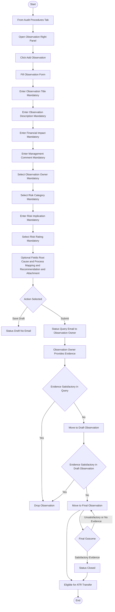

```mermaid
flowchart TD

%% ======================================
%% OBSERVATION LIFECYCLE WORKFLOW
%% ======================================

S0([Start]) --> S1[From Audit Procedures Tab]
S1 --> S2[Open Observation Right Panel]
S2 --> S3[Click Add Observation]

S3 --> F1[Fill Observation Form]

%% Mandatory fields as per PRD
F1 --> F2[Enter Observation Title Mandatory]
F2 --> F3[Enter Observation Description Mandatory]
F3 --> F4[Enter Financial Impact Mandatory]
F4 --> F5[Enter Management Comment Mandatory]
F5 --> F6[Select Observation Owner Mandatory]
F6 --> F7[Select Risk Category Mandatory]
F7 --> F8[Enter Risk Implication Mandatory]
F8 --> F9[Select Risk Rating Mandatory]

%% Optional fields
F9 --> O1[Optional Fields Root Cause and Process Mapping and Recommendation and Attachment]

O1 --> D1{Action Selected}
D1 -->|Save Draft| ST1[Status Draft No Email]
D1 -->|Submit| ST2[Status Query Email to Observation Owner]

ST2 --> R1[Observation Owner Provides Evidence]
R1 --> Q1{Evidence Satisfactory in Query}
Q1 -->|Yes| DR1[Drop Observation]
Q1 -->|No| ST3[Move to Draft Observation]

ST3 --> Q2{Evidence Satisfactory in Draft Observation}
Q2 -->|Yes| DR1
Q2 -->|No| ST4[Move to Final Observation]

ST4 --> C1{Final Outcome}
C1 -->|Satisfactory Evidence| CL1[Status Closed]
C1 -->|Unsatisfactory or No Evidence| ST4

ST4 --> ATR1[Eligible for ATR Transfer]
CL1 --> ATR1

ATR1 --> End([End])

```
