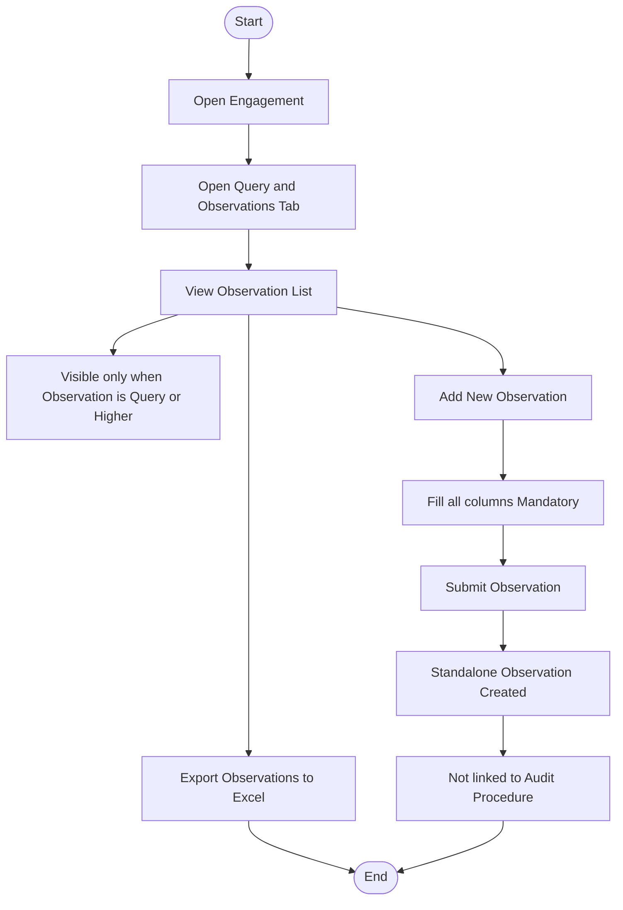

```mermaid
flowchart TD

%% ======================================
%% QUERY AND OBSERVATIONS TAB FLOW
%% ======================================

S0([Start]) --> S1[Open Engagement]
S1 --> S2[Open Query and Observations Tab]

S2 --> S3[View Observation List]
S3 --> S4[Visible only when Observation is Query or Higher]

S3 --> S5[Export Observations to Excel]
S3 --> S6[Add New Observation]

S6 --> S7[Fill all columns Mandatory]
S7 --> S8[Submit Observation]
S8 --> S9[Standalone Observation Created]
S9 --> S10[Not linked to Audit Procedure]

S5 --> End([End])
S10 --> End
```
