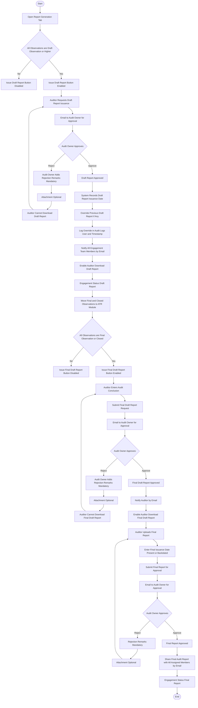

```mermaid
flowchart TD

%% ======================================
%% REPORT GENERATION WORKFLOW
%% Draft Report + Final Draft Report + Final Report Upload
%% ======================================

S0([Start]) --> S1[Open Report Generation Tab]

%% ------------------------------------------------
%% DRAFT REPORT ELIGIBILITY
%% ------------------------------------------------
S1 --> D1{All Observations are Draft Observation or Higher}
D1 -->|No| D2[Issue Draft Report Button Disabled]
D1 -->|Yes| D3[Issue Draft Report Button Enabled]

D3 --> D4[Auditor Requests Draft Report Issuance]
D4 --> D5[Email to Audit Owner for Approval]

D5 --> D6{Audit Owner Approves}
D6 -->|Reject| D7[Audit Owner Adds Rejection Remarks Mandatory]
D7 --> D8[Attachment Optional]
D8 --> D9[Auditor Cannot Download Draft Report]
D9 --> D4

D6 -->|Approve| D10[Draft Report Approved]
D10 --> D11[System Records Draft Report Issuance Date]
D11 --> D12[Override Previous Draft Report if Any]
D12 --> D13[Log Override in Audit Logs User and Timestamp]
D13 --> D14[Notify All Engagement Team Members by Email]
D14 --> D15[Enable Auditor Download Draft Report]

%% Engagement status update
D15 --> ST1[Engagement Status Draft Report]

%% ------------------------------------------------
%% MOVE OBSERVATIONS TO ATR
%% ------------------------------------------------
ST1 --> ATR1[Move Final and Closed Observations to ATR Module]

%% ------------------------------------------------
%% FINAL DRAFT REPORT ELIGIBILITY
%% ------------------------------------------------
ATR1 --> F1{All Observations are Final Observation or Closed}
F1 -->|No| F2[Issue Final Draft Report Button Disabled]
F1 -->|Yes| F3[Issue Final Draft Report Button Enabled]

F3 --> F4[Auditor Enters Audit Conclusion]
F4 --> F5[Submit Final Draft Report Request]
F5 --> F6[Email to Audit Owner for Approval]

F6 --> F7{Audit Owner Approves}
F7 -->|Reject| F8[Audit Owner Adds Rejection Remarks Mandatory]
F8 --> F9[Attachment Optional]
F9 --> F10[Auditor Cannot Download Final Draft Report]
F10 --> F4

F7 -->|Approve| F11[Final Draft Report Approved]
F11 --> F12[Notify Auditor by Email]
F12 --> F13[Enable Auditor Download Final Draft Report]

%% ------------------------------------------------
%% FINAL REPORT UPLOAD
%% ------------------------------------------------
F13 --> U1[Auditor Uploads Final Report]
U1 --> U2[Enter Final Issuance Date Present or Backdated]
U2 --> U3[Submit Final Report for Approval]
U3 --> U4[Email to Audit Owner for Approval]

U4 --> U5{Audit Owner Approves}
U5 -->|Reject| U6[Rejection Remarks Mandatory]
U6 --> U7[Attachment Optional]
U7 --> U1

U5 -->|Approve| U8[Final Report Approved]
U8 --> U9[Share Final Audit Report with All Assigned Members by Email]
U9 --> ST2[Engagement Status Final Report]
ST2 --> End([End])
```
