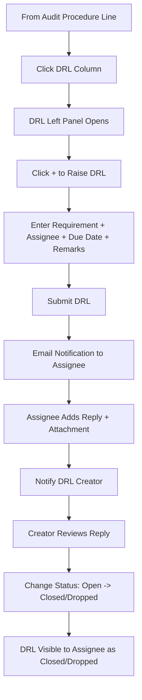

```mermaid
flowchart TD
A[From Audit Procedure Line] --> B[Click DRL Column]
B --> C[DRL Left Panel Opens]
C --> D[Click + to Raise DRL]
D --> E[Enter Requirement + Assignee + Due Date + Remarks]
E --> F[Submit DRL]
F --> G[Email Notification to Assignee]
G --> H[Assignee Adds Reply + Attachment]
H --> I[Notify DRL Creator]
I --> J[Creator Reviews Reply]
J --> K[Change Status: Open -> Closed/Dropped]
K --> L[DRL Visible to Assignee as Closed/Dropped]
```
