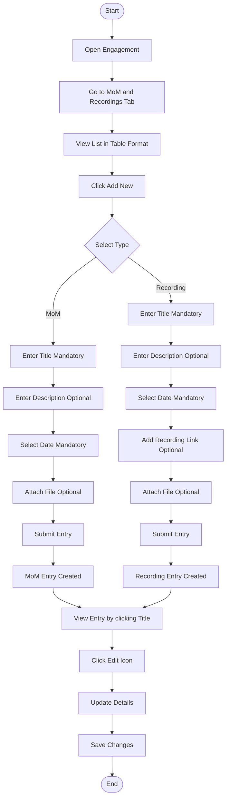

```mermaid
flowchart TD

%% ======================================
%% MOM AND RECORDINGS TAB FLOW
%% ======================================

M0([Start]) --> M1[Open Engagement]
M1 --> M2[Go to MoM and Recordings Tab]
M2 --> M3[View List in Table Format]

M3 --> M4[Click Add New]
M4 --> M5{Select Type}

%% --------- MoM Flow ----------
M5 -->|MoM| M6[Enter Title Mandatory]
M6 --> M7[Enter Description Optional]
M7 --> M8[Select Date Mandatory]
M8 --> M9[Attach File Optional]
M9 --> M10[Submit Entry]
M10 --> M11[MoM Entry Created]

%% --------- Recording Flow ----------
M5 -->|Recording| R6[Enter Title Mandatory]
R6 --> R7[Enter Description Optional]
R7 --> R8[Select Date Mandatory]
R8 --> R9[Add Recording Link Optional]
R9 --> R10[Attach File Optional]
R10 --> R11[Submit Entry]
R11 --> R12[Recording Entry Created]

%% --------- Edit / View ----------
M11 --> E1[View Entry by clicking Title]
R12 --> E1
E1 --> E2[Click Edit Icon]
E2 --> E3[Update Details]
E3 --> E4[Save Changes]

E4 --> MZ([End])
```
