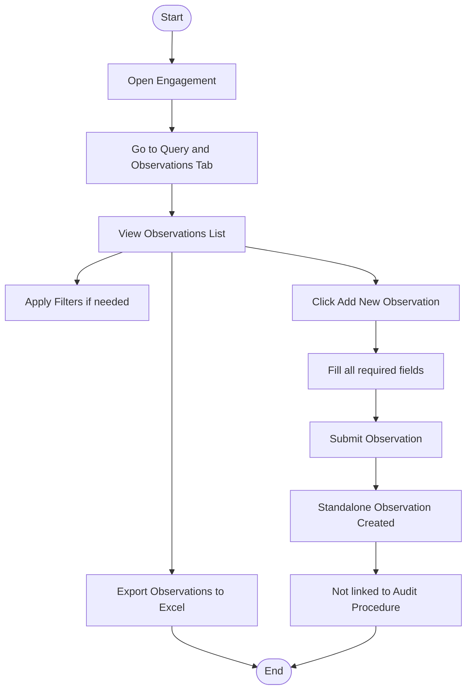

```mermaid
flowchart TD

%% ======================================
%% QUERY AND OBSERVATIONS TAB FLOW
%% ======================================

Q0([Start]) --> Q1[Open Engagement]
Q1 --> Q2[Go to Query and Observations Tab]

Q2 --> Q3[View Observations List]
Q3 --> Q4[Apply Filters if needed]
Q3 --> Q5[Export Observations to Excel]

Q3 --> Q6[Click Add New Observation]
Q6 --> Q7[Fill all required fields]
Q7 --> Q8[Submit Observation]
Q8 --> Q9[Standalone Observation Created]
Q9 --> Q10[Not linked to Audit Procedure]

Q5 --> QZ([End])
Q10 --> QZ
```
