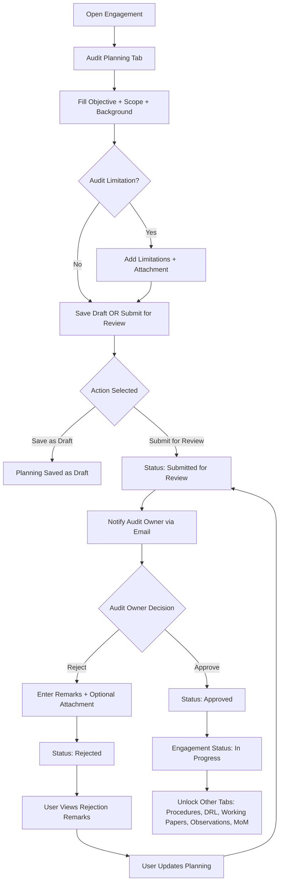

```mermaid
flowchart TD
A[Open Engagement] --> B[Audit Planning Tab]
B --> C[Fill Objective + Scope + Background]
C --> D{Audit Limitation?}
D -->|No| E[Save Draft OR Submit for Review]
D -->|Yes| F[Add Limitations + Attachment]
F --> E

E --> G{Action Selected}
G -->|Save as Draft| H[Planning Saved as Draft]
G -->|Submit for Review| I[Status: Submitted for Review]

I --> J[Notify Audit Owner via Email]
J --> K{Audit Owner Decision}
K -->|Approve| L[Status: Approved]
K -->|Reject| M[Enter Remarks + Optional Attachment]
M --> N[Status: Rejected]

N --> O[User Views Rejection Remarks]
O --> P[User Updates Planning]
P --> I

L --> Q[Engagement Status: In Progress]
Q --> R[Unlock Other Tabs: Procedures, DRL, Working Papers, Observations, MoM]
``` 
