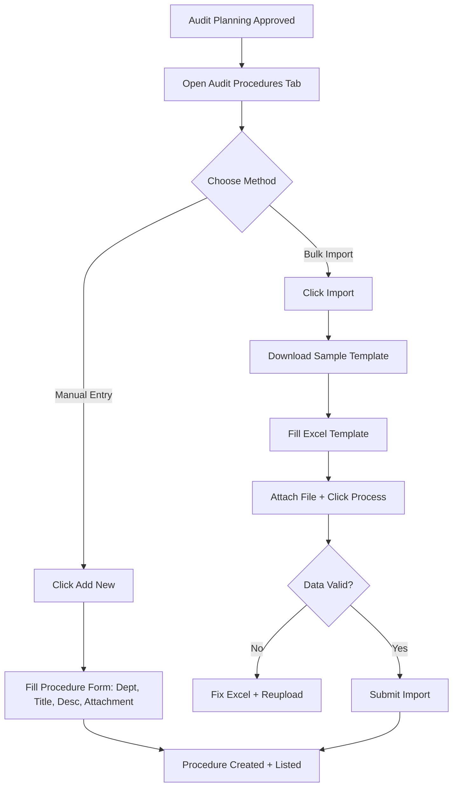

```mermaid
flowchart TD
A[Audit Planning Approved] --> B[Open Audit Procedures Tab]
B --> C{Choose Method}
C -->|Manual Entry| D[Click Add New]
D --> E[Fill Procedure Form: Dept, Title, Desc, Attachment]
E --> F[Procedure Created + Listed]

C -->|Bulk Import| G[Click Import]
G --> H[Download Sample Template]
H --> I[Fill Excel Template]
I --> J[Attach File + Click Process]
J --> K{Data Valid?}
K -->|No| L[Fix Excel + Reupload]
K -->|Yes| M[Submit Import]
M --> F
```
