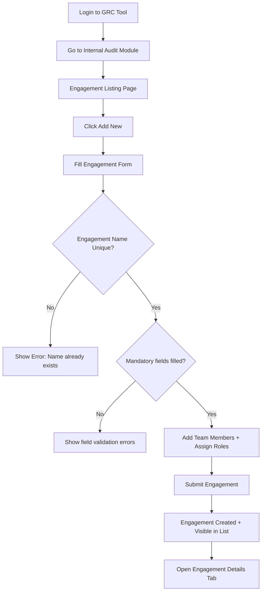

```mermaid
flowchart TD
A[Login to GRC Tool] --> B[Go to Internal Audit Module]
B --> C[Engagement Listing Page]
C --> D[Click Add New]
D --> E[Fill Engagement Form]
E --> F{Engagement Name Unique?}
F -->|No| G[Show Error: Name already exists]
F -->|Yes| H{Mandatory fields filled?}
H -->|No| I[Show field validation errors]
H -->|Yes| J[Add Team Members + Assign Roles]
J --> K[Submit Engagement]
K --> L[Engagement Created + Visible in List]
L --> M[Open Engagement Details Tab]
```
