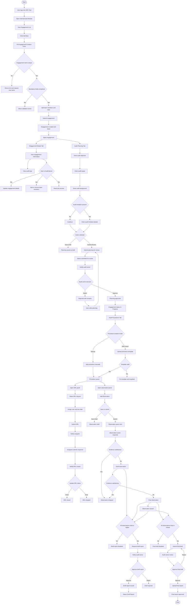

```mermaid
flowchart TD

%% ==================================================
%% INTERNAL AUDIT MODULE – END TO END FLOW
%% GitHub Mermaid Compatible (No Quotes in Labels)
%% ==================================================

Start([Start]) --> L1[User logs into GRC Tool]
L1 --> L2[Open Internal Audit Module]
L2 --> L3[View Engagement List]
L3 --> L4[Click Add New]
L4 --> L5[Fill Engagement Creation Form]

L5 --> D1{Engagement name unique}
D1 -->|No| E1[Show error and request new name]
D1 -->|Yes| D2{Mandatory fields completed}

D2 -->|No| E2[Show validation errors]
D2 -->|Yes| L6[Add team members and roles]
L6 --> L7[Submit engagement]
L7 --> L8[Engagement created and listed]
L8 --> L9[Open engagement]

%% --------------------------
%% ENGAGEMENT DETAILS
%% --------------------------
L9 --> ED1[Engagement Details Tab]
ED1 --> ED2[View engagement information]
ED2 --> ED3[View audit logs]

ED2 --> R1{User is Audit Owner}
R1 -->|Yes| ED4[Update engagement details]
R1 -->|Yes| ED5[Add or remove team members]
R1 -->|No| ED6[Read only access]

%% --------------------------
%% AUDIT PLANNING
%% --------------------------
L9 --> AP1[Audit Planning Tab]
AP1 --> AP2[Enter audit objective]
AP2 --> AP3[Enter audit scope]
AP3 --> AP4[Enter audit background]

AP4 --> D3{Audit limitation present}
D3 -->|No| AP5[Continue]
D3 -->|Yes| AP6[Enter audit limitation details]

AP5 --> AP7{Action selected}
AP6 --> AP7

AP7 -->|Save Draft| AP8[Planning saved as draft]
AP7 -->|Submit Review| AP9[Submit planning for review]

AP9 --> AP10[Status submitted for review]
AP10 --> AP11[Notify audit owner]

AP11 --> D4{Audit owner decision}
D4 -->|Approve| AP12[Planning approved]
D4 -->|Reject| AP13[Rejected with remarks]

AP13 --> AP14[User edits planning]
AP14 --> AP9

AP12 --> ST1[Engagement status In Progress]

%% --------------------------
%% AUDIT PROCEDURES
%% --------------------------
ST1 --> PR1[Audit Procedures Tab]
PR1 --> D5{Procedure creation mode}

D5 -->|Manual| PR2[Add procedure manually]
PR2 --> PR3[Procedure saved]

D5 -->|Bulk Import| PR4[Upload procedure template]
PR4 --> D6{Template valid}
D6 -->|No| PR5[Fix template and reupload]
D6 -->|Yes| PR3

%% --------------------------
%% DRL FLOW
%% --------------------------
PR3 --> DRL1[Open DRL panel]
DRL1 --> DRL2[Raise DRL request]
DRL2 --> DRL3[Assign user and due date]
DRL3 --> DRL4[Submit DRL]

DRL4 --> DRL5[Notify assignee]
DRL5 --> DRL6[Assignee submits response]
DRL6 --> DRL7[Notify DRL creator]

DRL7 --> D7{Update DRL status}
D7 -->|Close| DRL8[DRL closed]
D7 -->|Drop| DRL9[DRL dropped]

%% --------------------------
%% OBSERVATIONS
%% --------------------------
PR3 --> OB1[Open observation panel]
OB1 --> OB2[Add observation]
OB2 --> D8{Save or submit}

D8 -->|Save Draft| OB3[Observation draft]
D8 -->|Submit| OB4[Observation query sent]

OB4 --> OB5[Observation owner responds]

OB5 --> D9{Evidence satisfactory}
D9 -->|Yes| OB6[Observation dropped]
D9 -->|No| OB7[Draft observation]

OB7 --> D10{Evidence satisfactory}
D10 -->|Yes| OB6
D10 -->|No| OB8[Final observation]

OB8 --> OB9[Observation closed]

%% --------------------------
%% DRAFT REPORT
%% --------------------------
OB7 --> DR1{All observations draft or higher}
OB8 --> DR1
OB9 --> DR1

DR1 -->|No| DR2[Draft report disabled]
DR1 -->|Yes| DR3[Request draft report]

DR3 --> DR4[Notify audit owner]
DR4 --> D11{Approve draft report}

D11 -->|Approve| DR5[Draft report issued]
D11 -->|Reject| DR6[Draft rejected]

DR5 --> ST2[Status Draft Report]

%% --------------------------
%% FINAL REPORT
%% --------------------------
OB8 --> FR1{All observations final or closed}
OB9 --> FR1

FR1 -->|No| FR2[Final draft disabled]
FR1 -->|Yes| FR3[Submit final draft]

FR3 --> FR4[Audit owner review]
FR4 --> D12{Approve final draft}

D12 -->|Approve| FR5[Upload final report]
D12 -->|Reject| FR3

FR5 --> FR6[Final report approved]
FR6 --> End([End])
```
