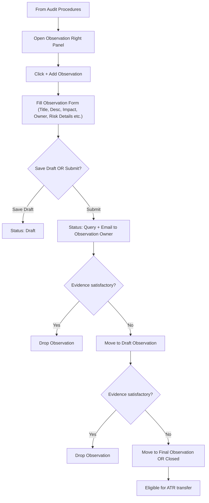

```mermaid
flowchart TD
A[From Audit Procedures] --> B[Open Observation Right Panel]
B --> C[Click + Add Observation]
C --> D["Fill Observation Form (Title, Desc, Impact, Owner, Risk Details etc.)"]

D --> E{Save Draft OR Submit?}
E -->|Save Draft| F[Status: Draft]
E -->|Submit| G[Status: Query + Email to Observation Owner]

G --> H{Evidence satisfactory?}
H -->|Yes| I[Drop Observation]
H -->|No| J[Move to Draft Observation]

J --> K{Evidence satisfactory?}
K -->|Yes| L[Drop Observation]
K -->|No| M[Move to Final Observation OR Closed]
M --> N[Eligible for ATR transfer]
```
