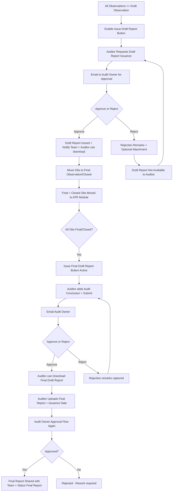

```mermaid
flowchart TD
A[All Observations >= Draft Observation] --> B[Enable Issue Draft Report Button]
B --> C[Auditor Requests Draft Report Issuance]
C --> D[Email to Audit Owner for Approval]
D --> E{Approve or Reject}
E -->|Approve| F[Draft Report Issued + Notify Team + Auditor can download]
E -->|Reject| G[Rejection Remarks + Optional Attachment]
G --> H[Draft Report Not Available to Auditor]
H --> C

F --> I[Move Obs to Final Observation/Closed]
I --> J[Final + Closed Obs Moved to ATR Module]

J --> K{All Obs Final/Closed?}
K -->|Yes| L[Issue Final Draft Report Button Active]
L --> M[Auditor adds Audit Conclusion + Submit]
M --> N[Email Audit Owner]
N --> O{Approve or Reject}
O -->|Approve| P[Auditor can Download Final Draft Report]
O -->|Reject| Q[Rejection remarks captured]
Q --> M

P --> R[Auditor Uploads Final Report + Issuance Date]
R --> S[Audit Owner Approval Flow Again]
S --> T{Approved?}
T -->|Yes| U[Final Report Shared with Team + Status Final Report]
T -->|No| V[Rejected - Rework required]
```
