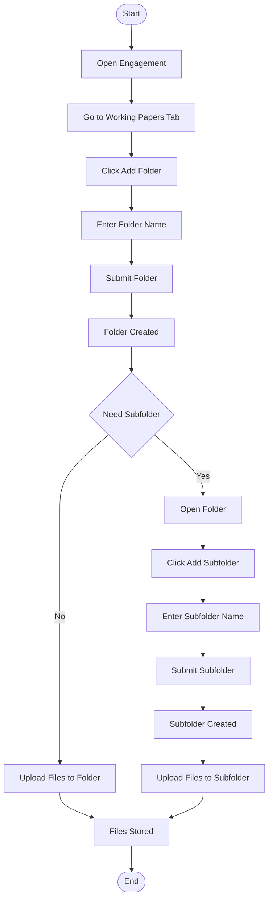

```mermaid
flowchart TD

%% ================================
%% WORKING PAPERS TAB FLOW
%% ================================

WP0([Start]) --> WP1[Open Engagement]
WP1 --> WP2[Go to Working Papers Tab]

WP2 --> WP3[Click Add Folder]
WP3 --> WP4[Enter Folder Name]
WP4 --> WP5[Submit Folder]
WP5 --> WP6[Folder Created]

WP6 --> WP7{Need Subfolder}
WP7 -->|No| WP8[Upload Files to Folder]
WP7 -->|Yes| WP9[Open Folder]
WP9 --> WP10[Click Add Subfolder]
WP10 --> WP11[Enter Subfolder Name]
WP11 --> WP12[Submit Subfolder]
WP12 --> WP13[Subfolder Created]
WP13 --> WP14[Upload Files to Subfolder]

WP8 --> WP15[Files Stored]
WP14 --> WP15
WP15 --> WPZ([End])
```
