# ATR Module Flowcharts (SVG-safe Mermaid for GitHub)

> This file contains **all ATR flowcharts** combined into one Markdown file.
> Each flowchart is in an individual Mermaid block for GitHub preview + SVG export.

---

## 01_atr_overview_and_navigation

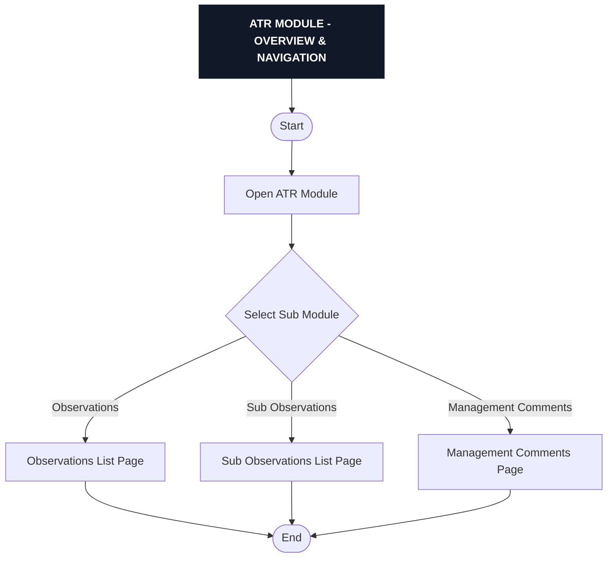

---

## 02_atr_observations_list_and_filters

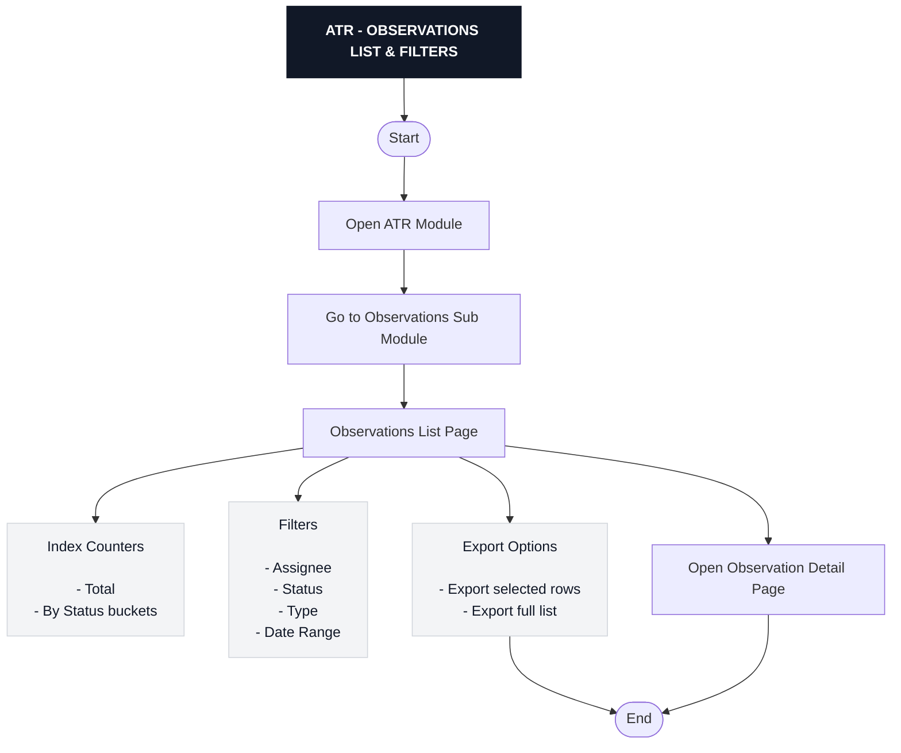

---

## 03_atr_observations_manual_creation

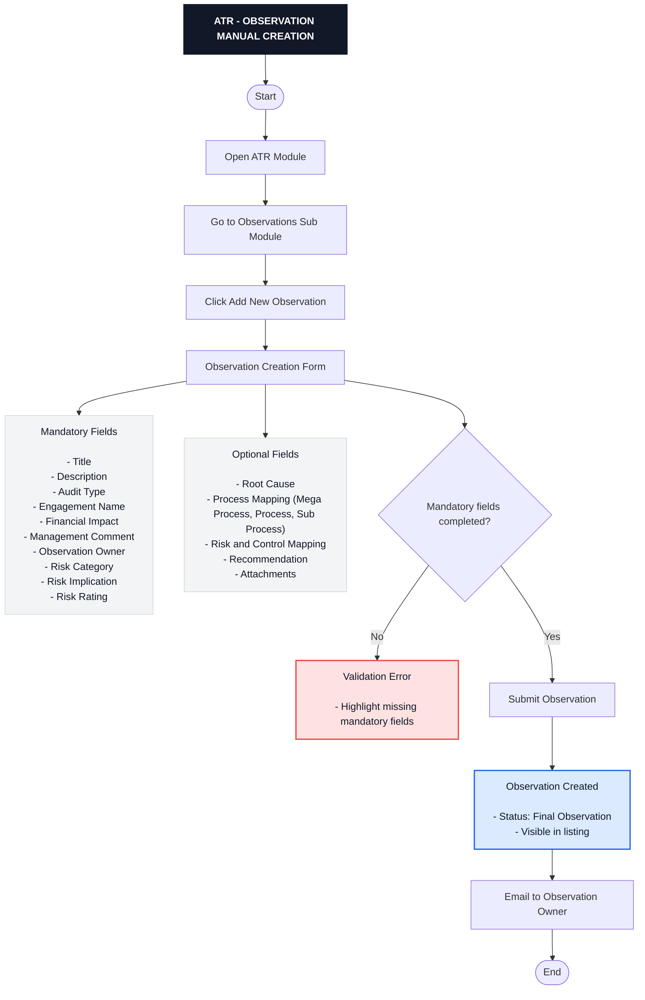

---

## 04_atr_observations_bulk_import

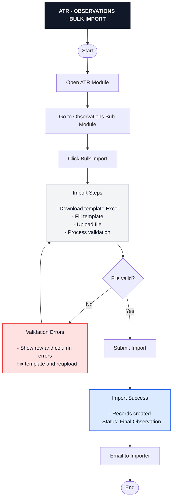

---

## 05_ia_to_atr_sync_flow

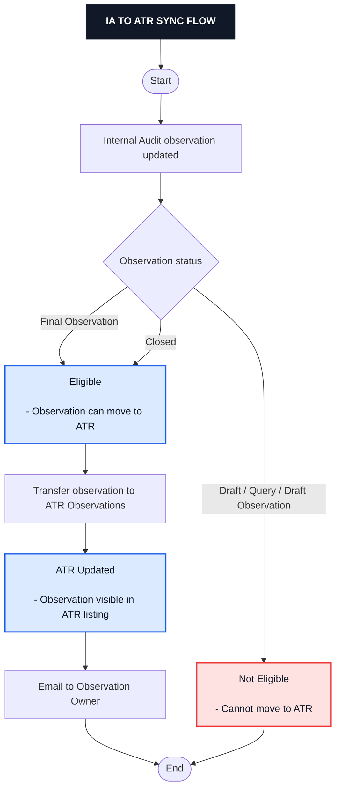

---

## 06_atr_observation_detail_and_actions

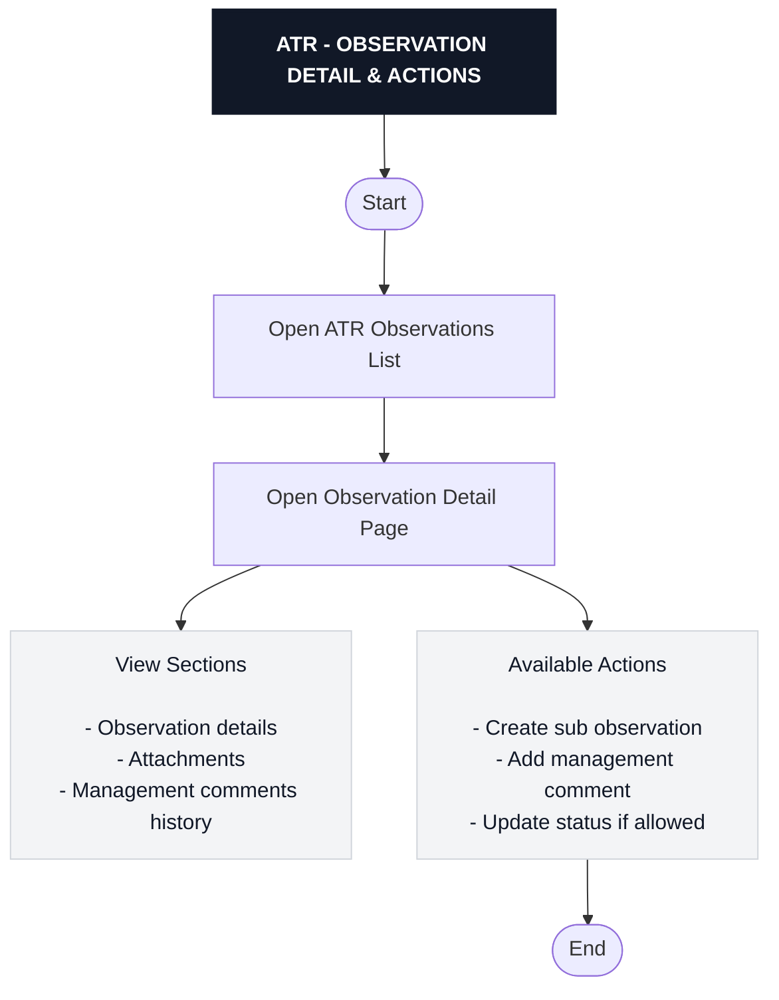

---

## 07_atr_sub_observations_list_and_filters

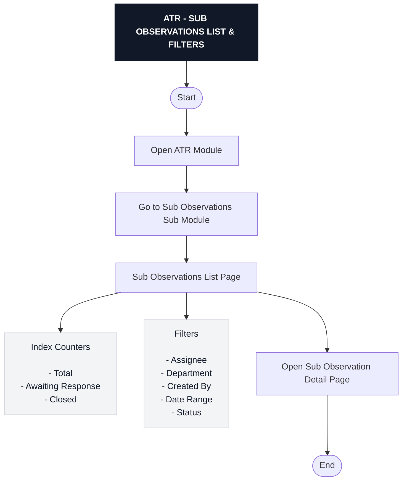

---

## 08_atr_sub_observation_creation

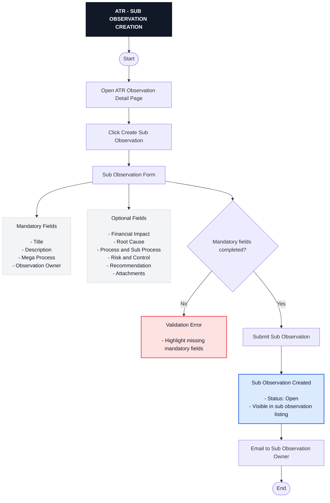

---

## 09_atr_sub_observation_status_workflow

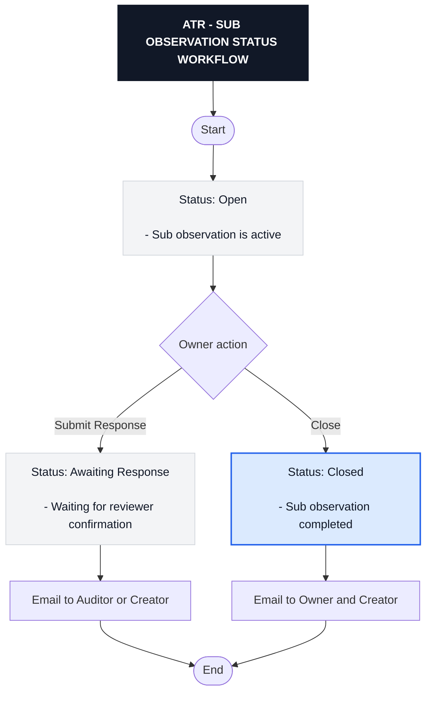

---

## 10_atr_management_comments_flow

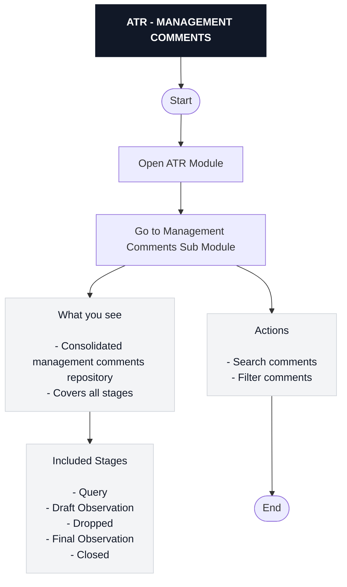

---

## 11_atr_notifications_overview

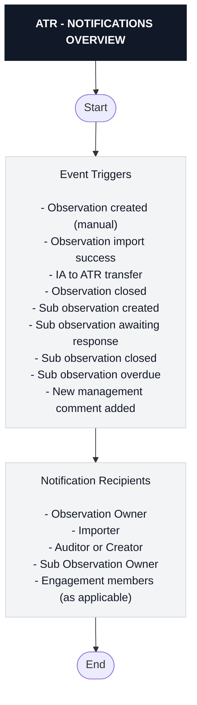

---

## 99_atr_full_end_to_end

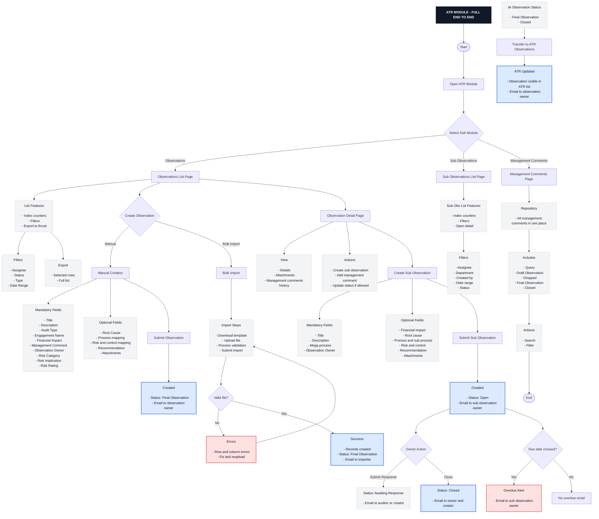

---
