# Internal Audit Module Flowcharts (SVG-safe Mermaid for GitHub)

> This file contains **all Internal Audit flowcharts** combined into one Markdown file.
> Each flowchart is in an individual Mermaid block for GitHub preview + SVG export.

---

## 01_engagement_creation

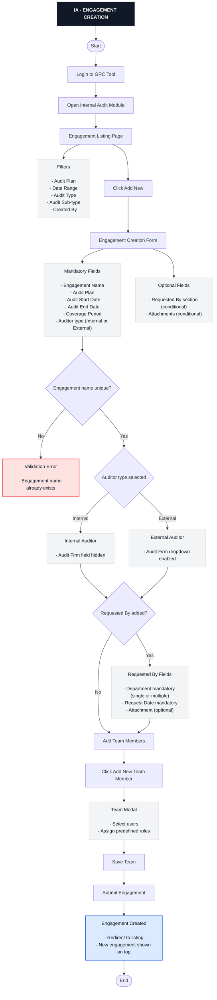

---

## 02_engagement_details_tab

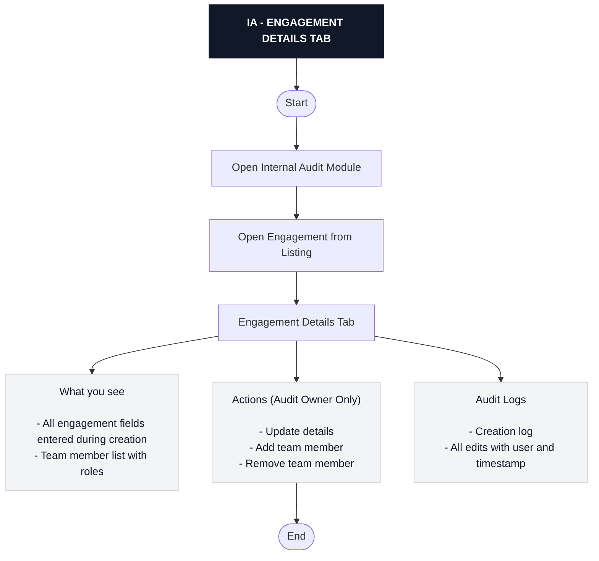

---

## 03_audit_planning_tab

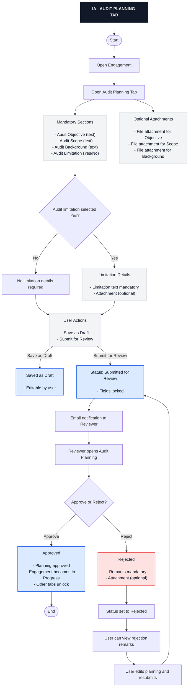

---

## 04_tab_unlocks_and_engagement_status

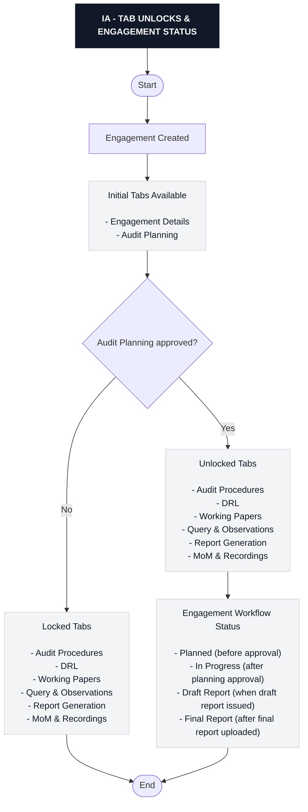

---

## 05_audit_procedures_bulk_import

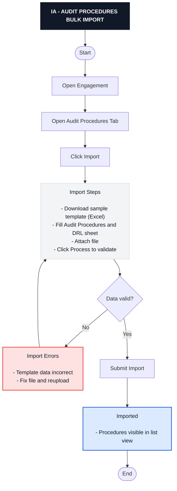

---

## 06_audit_procedures_manual_creation

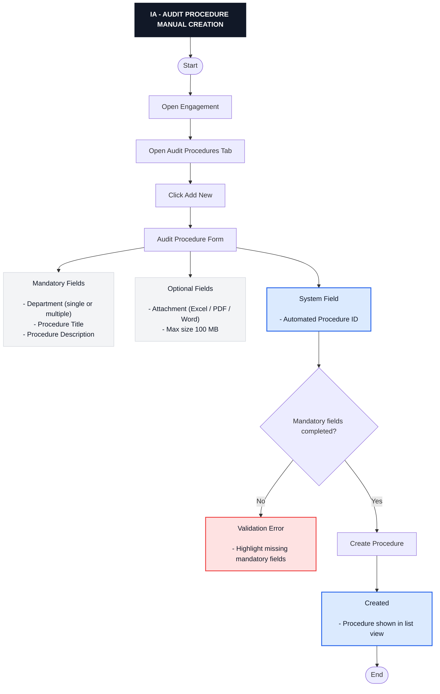

---

## 07_drl_raise_and_response_workflow

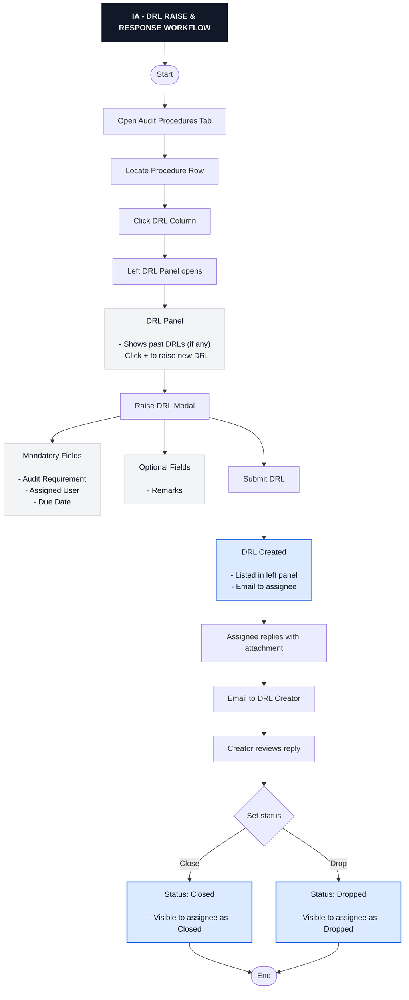

---

## 08_drl_tab_list_filters_export

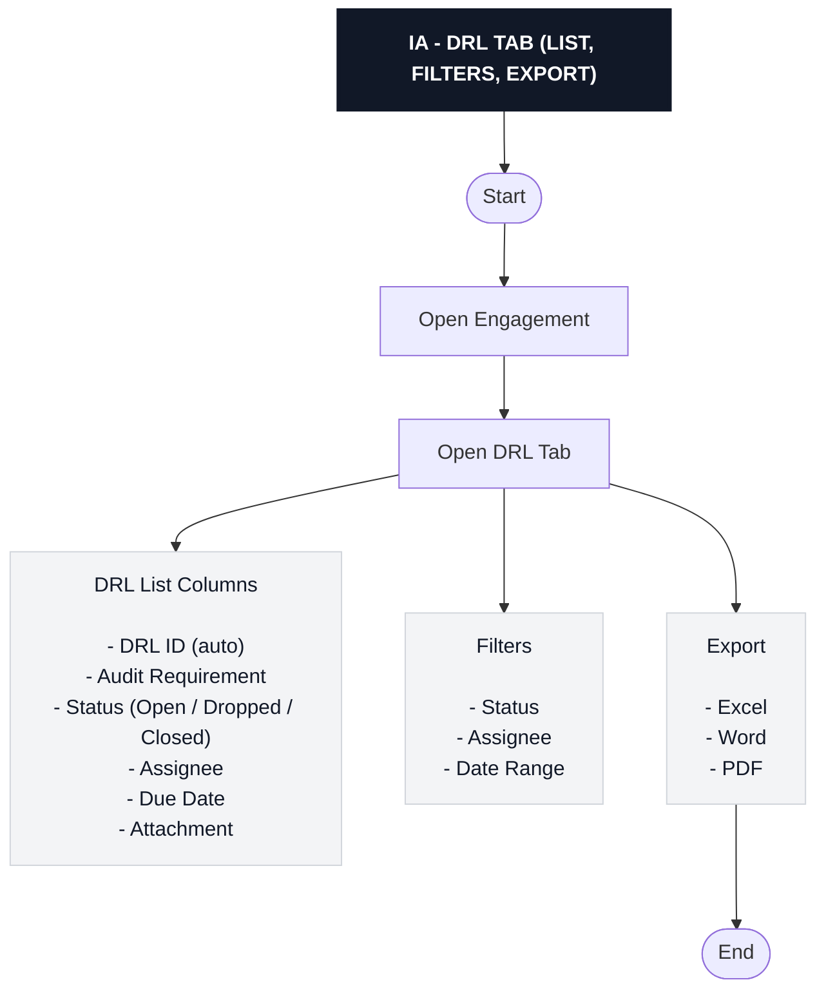

---

## 09_working_papers_folders_upload

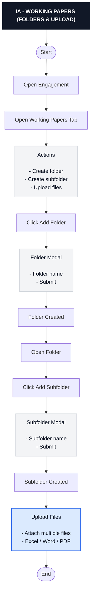

---

## 10_observation_creation_from_procedure

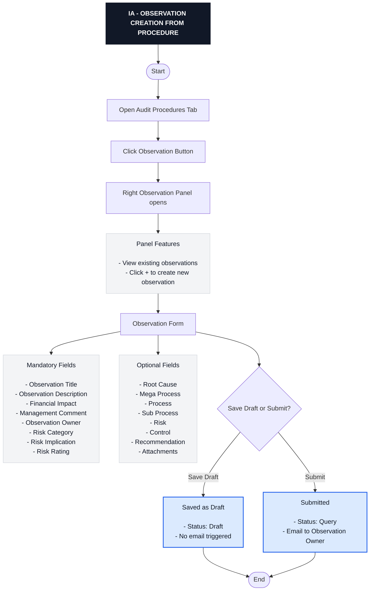

---

## 11_observation_lifecycle_workflow

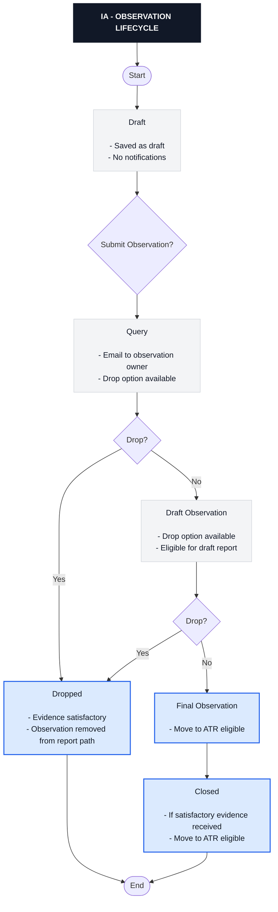

---

## 12_query_observations_tab_list_export_add

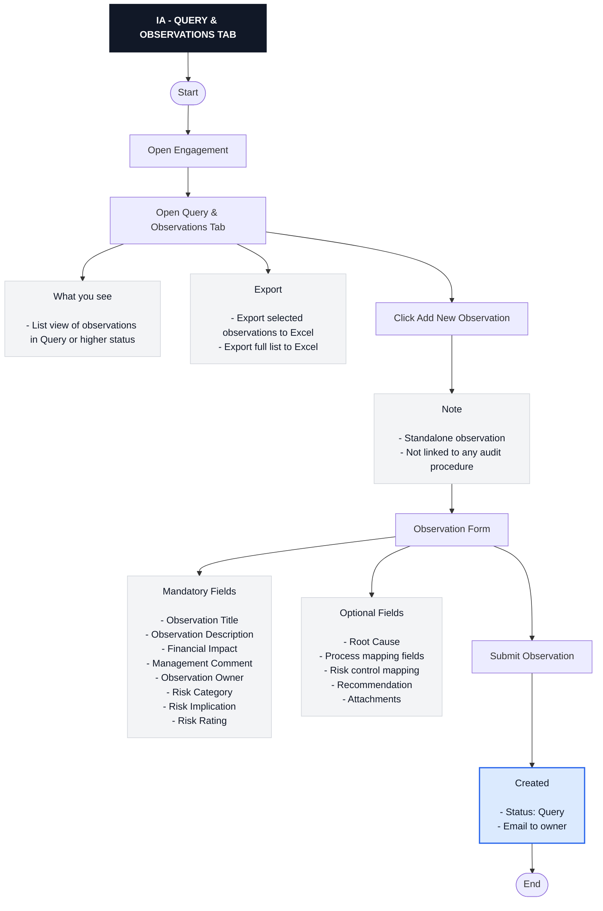

---

## 13_report_generation_draft_report

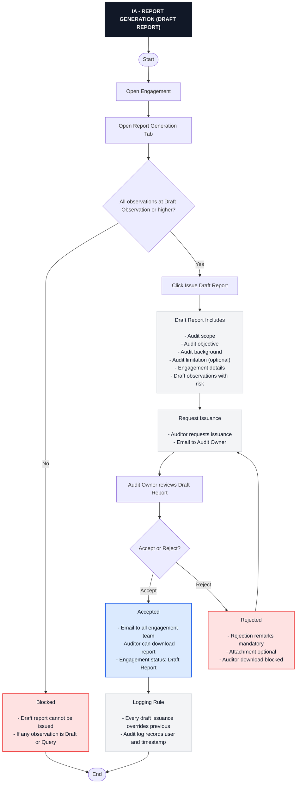

---

## 14_report_generation_final_draft_and_final_upload

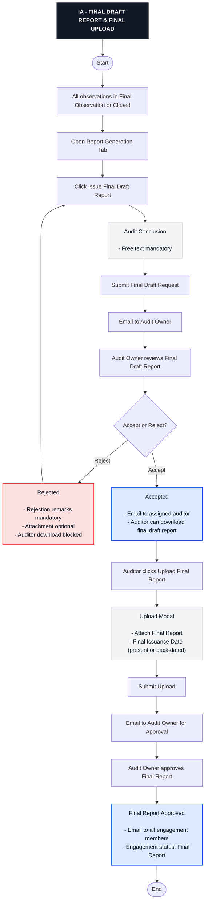

---

## 15_atr_transfer_rule

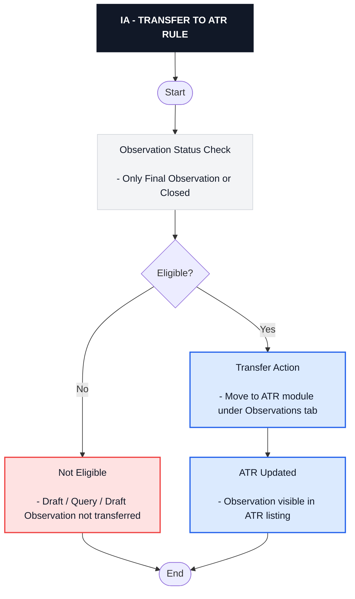

---

## 16_mom_and_recordings_create_edit

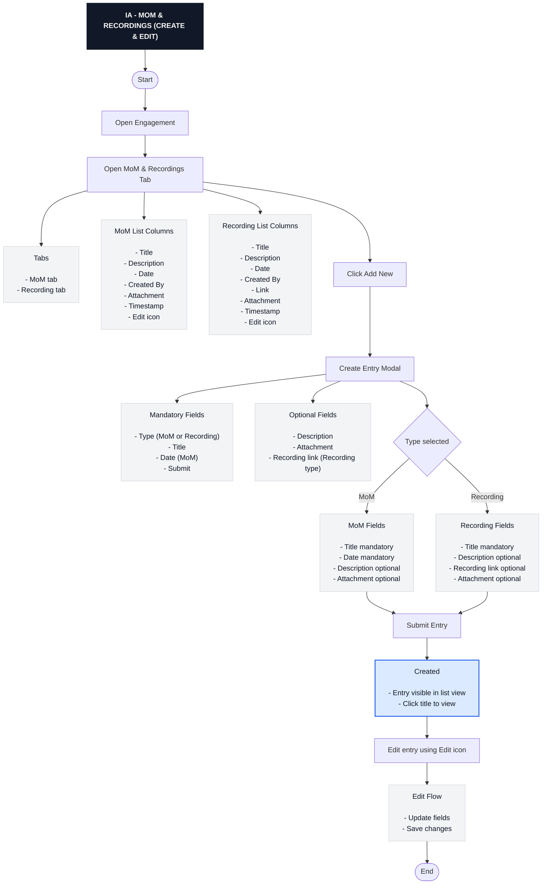

---

## 99_ia_full_end_to_end

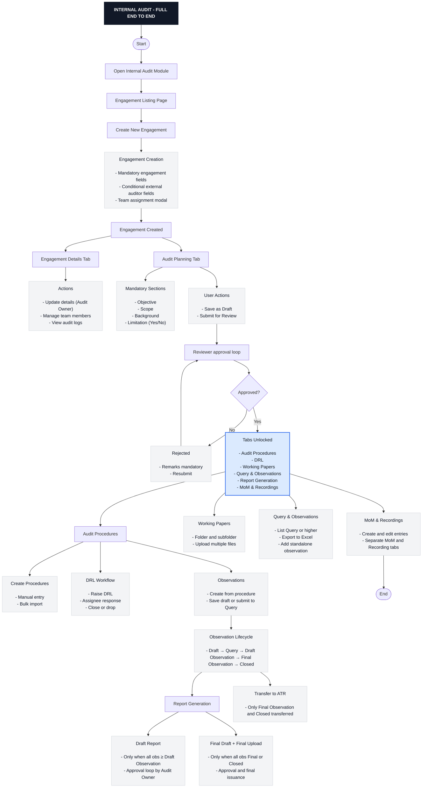

---
