# Vendor Management Module Flowcharts (SVG-safe Mermaid for GitHub)

> This file contains **all Vendor Management flowcharts** combined into one Markdown file.
> Each flowchart is in an individual Mermaid block for GitHub preview + SVG export.

---

## 01_budget_listing_and_creation

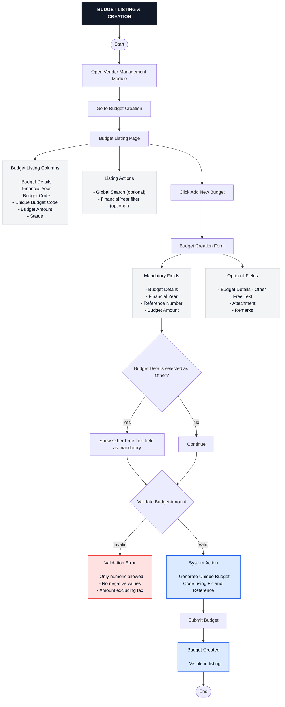

---

## 02_budget_approval_workflow

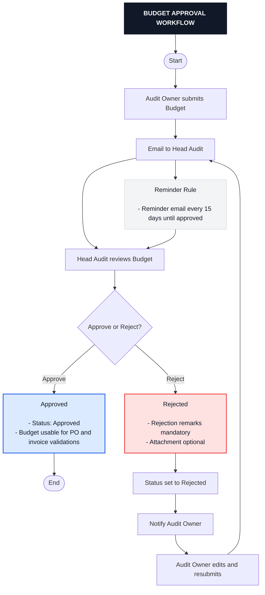

---

## 03_vendor_listing_and_creation

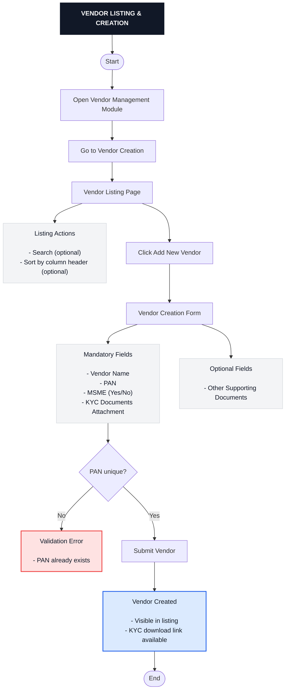

---

## 04_po_listing_and_creation

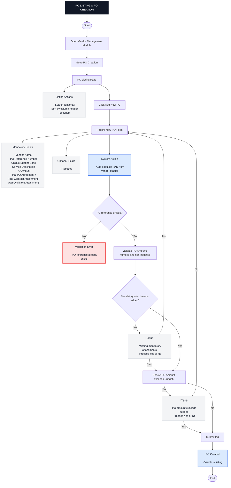

---

## 05_po_approval_and_status_logic

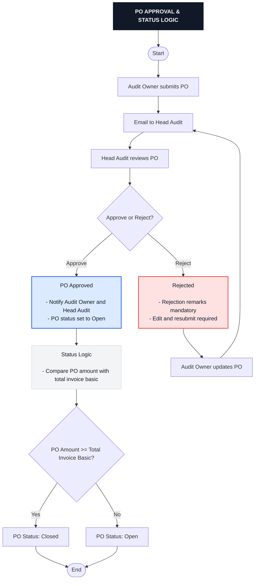

---

## 06_po_short_closure_workflow

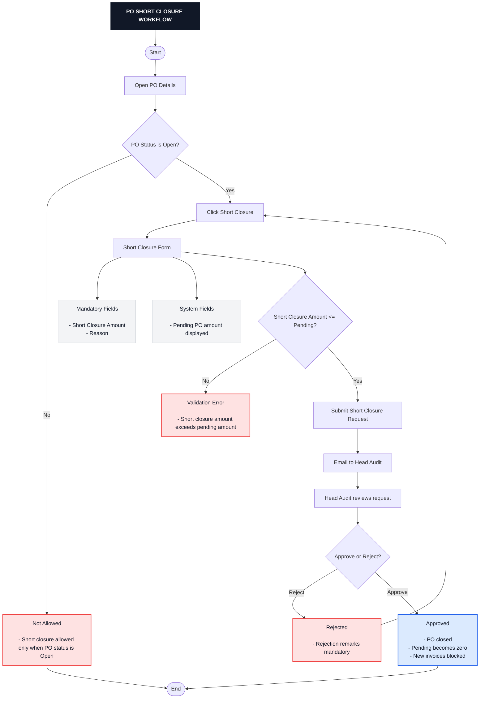

---

## 07_invoice_listing_and_recording

```mermaid
flowchart TD

classDef heading fill:#111827,stroke:#111827,color:#ffffff,stroke-width:3px,font-weight:bold;
classDef info fill:#F3F4F6,stroke:#D1D5DB,color:#111827;
classDef error fill:#FEE2E2,stroke:#EF4444,color:#111827,stroke-width:2px;
classDef action fill:#DBEAFE,stroke:#2563EB,color:#111827,stroke-width:2px;

T["INVOICE LISTING & RECORDING"]:::heading --> S0([Start])

S0 --> S1[Open Vendor Management Module]
S1 --> S2[Go to Invoice Recording]
S2 --> S3[Invoice Listing Page]

S3 --> L1["Listing Actions

- Search (optional)
- Sort by column header (optional)
- Payment approval reference visible"]:::info

S3 --> S4[Click Record New Invoice]
S4 --> F1[Invoice Recording Form]

F1 --> FM1["Mandatory Fields

- PO Reference
- Invoice Number
- Basic Amount
- Invoice Attachment"]:::info

F1 --> FO1["Optional Fields

- IGST
- CGST
- SGST
- Remarks (if deliverables not received)"]:::info

F1 --> AP1["System Action

- Auto populate PAN, PO date, service description
- Total amount = basic + taxes"]:::action

AP1 --> V1{Invoice number unique?}

V1 -->|No| V2["Validation Error

- Invoice number already exists"]:::error

V1 -->|Yes| C1{Deliverables received?}

C1 -->|Yes| P1[Proceed]
C1 -->|No| R1[Enter Remarks (mandatory)]
R1 --> P1

P1 --> CHK1{Invoice basic amount exceeds PO amount?}

CHK1 -->|Yes| ERR1["Error

- Invoice amount exceeds PO amount"]:::error

CHK1 -->|No| SUB1[Submit Invoice]
SUB1 --> OUT1["Invoice Created

- Visible in listing"]:::action
OUT1 --> End([End])
```

---

## 08_invoice_approval_and_payment_reference

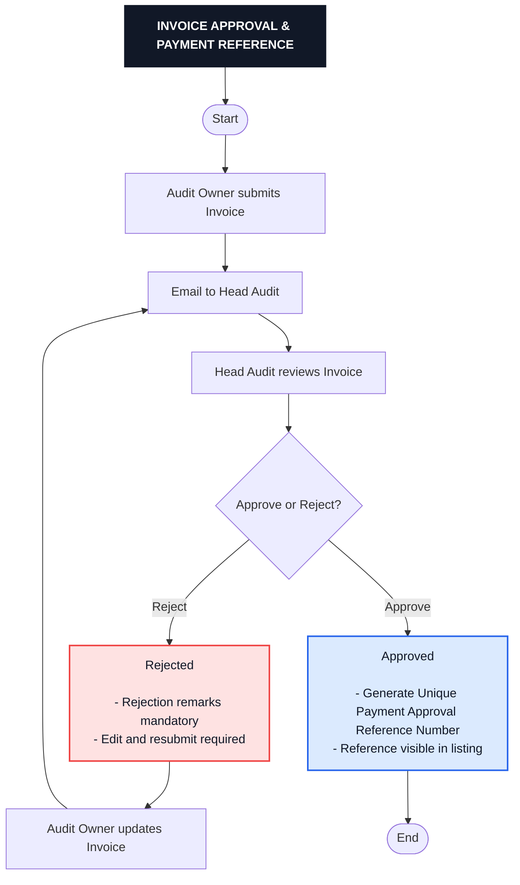

---

## 09_payment_top_sheet_flow

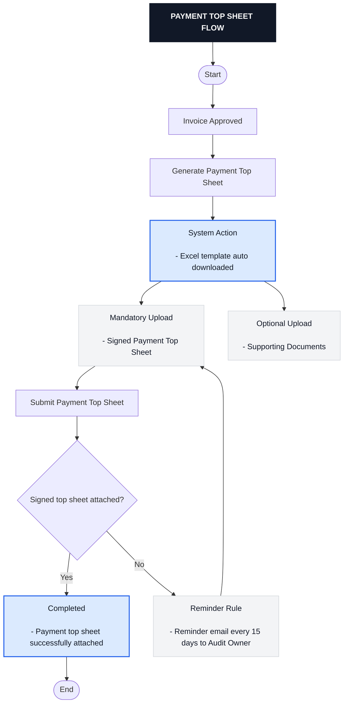

---

## 10_budget_vs_po_view

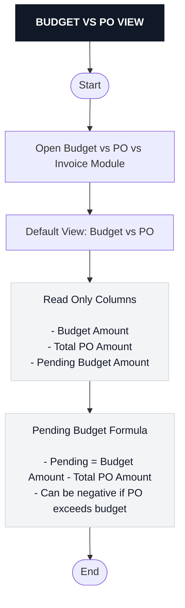

---

## 11_po_vs_invoice_view_and_drilldown

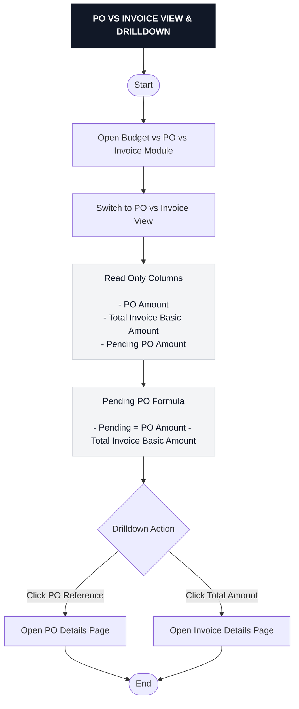

---

## 99_vendor_management_full_end_to_end

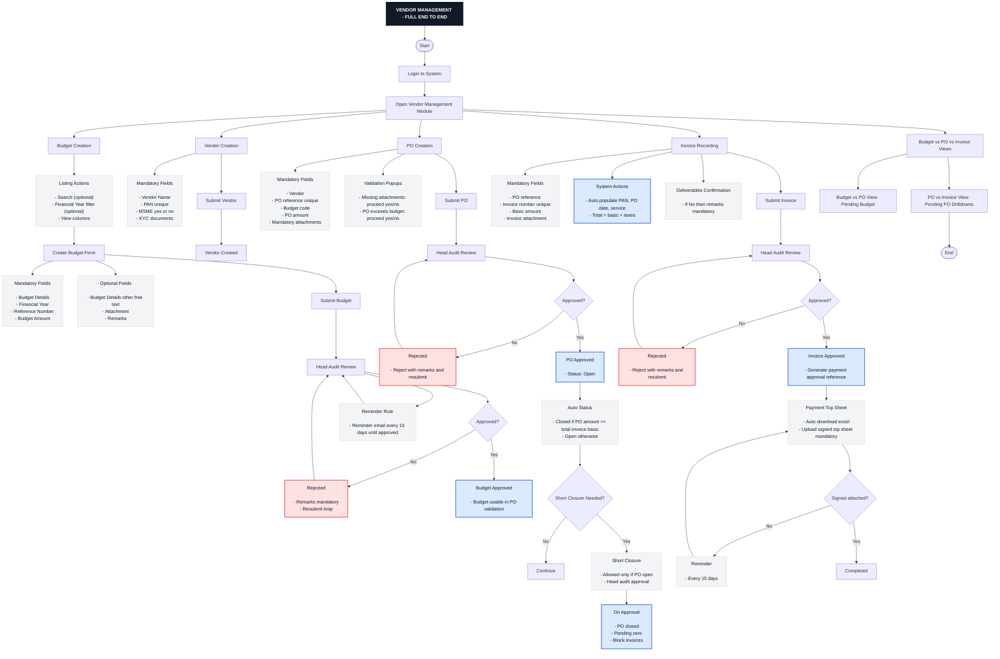

---
