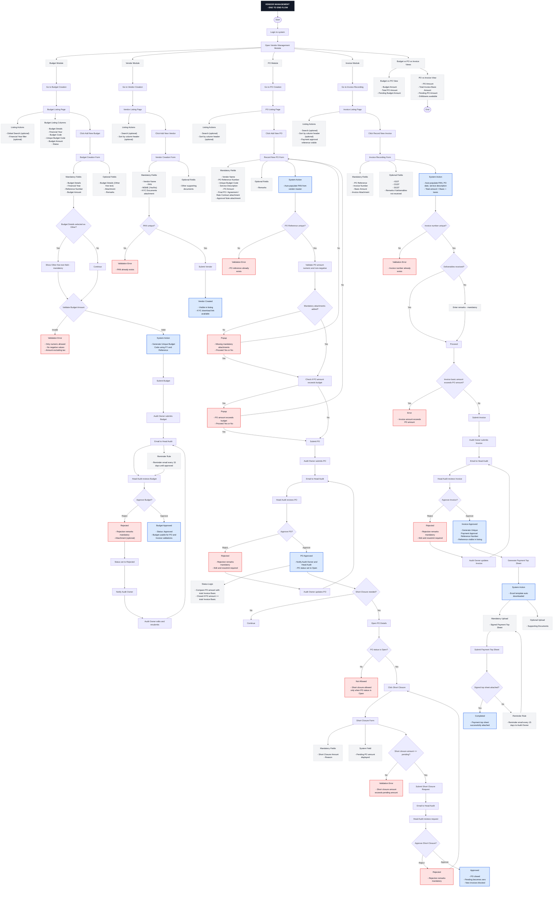

```mermaid
flowchart TD

%% =========================
%% STYLES (SVG SAFE)
%% =========================
classDef heading fill:#111827,stroke:#111827,color:#ffffff,stroke-width:3px,font-weight:bold;
classDef info fill:#F3F4F6,stroke:#D1D5DB,color:#111827,stroke-width:1px;
classDef error fill:#FEE2E2,stroke:#EF4444,color:#111827,stroke-width:2px;
classDef action fill:#DBEAFE,stroke:#2563EB,color:#111827,stroke-width:2px;

T["VENDOR MANAGEMENT - END TO END FLOW"]:::heading --> START([Start])

%% =========================
%% ENTRY
%% =========================
START --> A1[Login to system]
A1 --> A2[Open Vendor Management Module]

%% =========================
%% BUDGET CREATION + APPROVAL
%% =========================
A2 --> B0["Budget Module"]:::info

B0 --> B1[Go to Budget Creation]
B1 --> B2[Budget Listing Page]

B2 --> B3["Listing Actions

- Global Search (optional)
- Financial Year filter (optional)"]:::info

B2 --> B4["Budget Listing Columns

- Budget Details
- Financial Year
- Budget Code
- Unique Budget Code
- Budget Amount
- Status"]:::info

B2 --> B5[Click Add New Budget]
B5 --> B6[Budget Creation Form]

B6 --> B7["Mandatory Fields

- Budget Details
- Financial Year
- Reference Number
- Budget Amount"]:::info

B6 --> B8["Optional Fields

- Budget Details (Other free text)
- Attachment
- Remarks"]:::info

B7 --> B9{Budget Details selected as Other?}
B9 -->|Yes| B10["Show Other free text field - mandatory"]
B9 -->|No| B11[Continue]

B10 --> B12{Validate Budget Amount}
B11 --> B12

B12 -->|Invalid| B13["Validation Error

- Only numeric allowed
- No negative values
- Amount excluding tax"]:::error

B12 -->|Valid| B14["System Action

- Generate Unique Budget Code using FY and Reference"]:::action

B14 --> B15[Submit Budget]
B15 --> B16[Audit Owner submits Budget]
B16 --> B17[Email to Head Audit]
B17 --> B18[Head Audit reviews Budget]

B18 --> B19{Approve Budget?}

B19 -->|Reject| B20["Rejected

- Rejection remarks mandatory
- Attachment (optional)"]:::error
B20 --> B21[Status set to Rejected]
B21 --> B22[Notify Audit Owner]
B22 --> B23[Audit Owner edits and resubmits]
B23 --> B17

B19 -->|Approve| B24["Budget Approved

- Status: Approved
- Budget usable for PO and Invoice validations"]:::action

B17 --> B25["Reminder Rule

- Reminder email every 15 days until approved"]:::info
B25 --> B18

%% =========================
%% VENDOR CREATION
%% =========================
A2 --> V0["Vendor Module"]:::info

V0 --> V1[Go to Vendor Creation]
V1 --> V2[Vendor Listing Page]

V2 --> V3["Listing Actions

- Search (optional)
- Sort by column header (optional)"]:::info

V2 --> V4[Click Add New Vendor]
V4 --> V5[Vendor Creation Form]

V5 --> V6["Mandatory Fields

- Vendor Name
- PAN
- MSME (Yes/No)
- KYC Documents attachment"]:::info

V5 --> V7["Optional Fields

- Other supporting documents"]:::info

V6 --> V8{PAN unique?}

V8 -->|No| V9["Validation Error

- PAN already exists"]:::error

V8 -->|Yes| V10[Submit Vendor]
V10 --> V11["Vendor Created

- Visible in listing
- KYC download link available"]:::action

%% =========================
%% PO CREATION + APPROVAL + STATUS
%% =========================
A2 --> P0["PO Module"]:::info

P0 --> P1[Go to PO Creation]
P1 --> P2[PO Listing Page]

P2 --> P3["Listing Actions

- Search (optional)
- Sort by column header (optional)"]:::info

P2 --> P4[Click Add New PO]
P4 --> P5[Record New PO Form]

P5 --> P6["Mandatory Fields

- Vendor Name
- PO Reference Number
- Unique Budget Code
- Service Description
- PO Amount
- Final PO / Agreement / Rate Contract attachment
- Approval Note attachment"]:::info

P5 --> P7["Optional Fields

- Remarks"]:::info

P5 --> P8["System Action

- Auto-populate PAN from vendor master"]:::action

P8 --> P9{PO Reference unique?}

P9 -->|No| P10["Validation Error

- PO reference already exists"]:::error

P9 -->|Yes| P11[Validate PO amount numeric and non-negative]

P11 --> P12{Mandatory attachments added?}

P12 -->|No| P13["Popup

- Missing mandatory attachments
- Proceed Yes or No"]:::error
P13 -->|No| P5
P13 -->|Yes| P14[Check if PO amount exceeds budget]

P12 -->|Yes| P14

P14 -->|Yes| P15["Popup

- PO amount exceeds budget
- Proceed Yes or No"]:::error
P15 -->|No| P5
P15 -->|Yes| P16[Submit PO]

P14 -->|No| P16

P16 --> P17[Audit Owner submits PO]
P17 --> P18[Email to Head Audit]
P18 --> P19[Head Audit reviews PO]

P19 --> P20{Approve PO?}

P20 -->|Reject| P21["Rejected

- Rejection remarks mandatory
- Edit and resubmit required"]:::error
P21 --> P22[Audit Owner updates PO]
P22 --> P18

P20 -->|Approve| P23["PO Approved

- Notify Audit Owner and Head Audit
- PO status set to Open"]:::action

P23 --> P24["Status Logic

- Compare PO amount with total Invoice Basic
- Closed if PO amount >= total Invoice Basic"]:::info

%% =========================
%% PO SHORT CLOSURE
%% =========================
P23 --> SC0{Short Closure needed?}

SC0 -->|No| SC1[Continue]
SC0 -->|Yes| SC2[Open PO Details]
SC2 --> SC3{PO status is Open?}

SC3 -->|No| SC4["Not Allowed

- Short closure allowed only when PO status is Open"]:::error

SC3 -->|Yes| SC5[Click Short Closure]
SC5 --> SC6[Short Closure Form]

SC6 --> SC7["Mandatory Fields

- Short Closure Amount
- Reason"]:::info

SC6 --> SC8["System Field

- Pending PO amount displayed"]:::info

SC6 --> SC9{Short closure amount <= pending?}

SC9 -->|No| SC10["Validation Error

- Short closure amount exceeds pending amount"]:::error

SC9 -->|Yes| SC11[Submit Short Closure Request]
SC11 --> SC12[Email to Head Audit]
SC12 --> SC13[Head Audit reviews request]

SC13 --> SC14{Approve Short Closure?}

SC14 -->|Reject| SC15["Rejected

- Rejection remarks mandatory"]:::error
SC15 --> SC5

SC14 -->|Approve| SC16["Approved

- PO closed
- Pending becomes zero
- New invoices blocked"]:::action

%% =========================
%% INVOICE RECORDING + APPROVAL
%% =========================
A2 --> I0["Invoice Module"]:::info

I0 --> I1[Go to Invoice Recording]
I1 --> I2[Invoice Listing Page]

I2 --> I3["Listing Actions

- Search (optional)
- Sort by column header (optional)
- Payment approval reference visible"]:::info

I2 --> I4[Click Record New Invoice]
I4 --> I5[Invoice Recording Form]

I5 --> I6["Mandatory Fields

- PO Reference
- Invoice Number
- Basic Amount
- Invoice Attachment"]:::info

I5 --> I7["Optional Fields

- IGST
- CGST
- SGST
- Remarks if deliverables not received"]:::info

I5 --> I8["System Action

- Auto-populate PAN, PO date, service description
- Total amount = Basic + taxes"]:::action

I8 --> I9{Invoice number unique?}

I9 -->|No| I10["Validation Error

- Invoice number already exists"]:::error

I9 -->|Yes| I11{Deliverables received?}

I11 -->|Yes| I12[Proceed]
I11 -->|No| I13["Enter remarks - mandatory"]:::info
I13 --> I12

I12 --> I14{Invoice basic amount exceeds PO amount?}

I14 -->|Yes| I15["Error

- Invoice amount exceeds PO amount"]:::error

I14 -->|No| I16[Submit Invoice]
I16 --> I17[Audit Owner submits Invoice]
I17 --> I18[Email to Head Audit]
I18 --> I19[Head Audit reviews Invoice]

I19 --> I20{Approve Invoice?}

I20 -->|Reject| I21["Rejected

- Rejection remarks mandatory
- Edit and resubmit required"]:::error
I21 --> I22[Audit Owner updates Invoice]
I22 --> I18

I20 -->|Approve| I23["Invoice Approved

- Generate Unique Payment Approval Reference Number
- Reference visible in listing"]:::action

%% =========================
%% PAYMENT TOP SHEET
%% =========================
I23 --> PT1[Generate Payment Top Sheet]
PT1 --> PT2["System Action

- Excel template auto downloaded"]:::action

PT2 --> PT3["Mandatory Upload

- Signed Payment Top Sheet"]:::info

PT2 --> PT4["Optional Upload

- Supporting Documents"]:::info

PT3 --> PT5[Submit Payment Top Sheet]
PT5 --> PT6{Signed top sheet attached?}

PT6 -->|Yes| PT7["Completed

- Payment top sheet successfully attached"]:::action

PT6 -->|No| PT8["Reminder Rule

- Reminder email every 15 days to Audit Owner"]:::info
PT8 --> PT3

%% =========================
%% REPORTING VIEWS
%% =========================
A2 --> R0["Budget vs PO vs Invoice Views"]:::info

R0 --> R1["Budget vs PO View

- Budget Amount
- Total PO Amount
- Pending Budget Amount"]:::info

R0 --> R2["PO vs Invoice View

- PO Amount
- Total Invoice Basic Amount
- Pending PO Amount
- Drilldowns available"]:::info

R2 --> END([End])
```
