# Vendor Management Individual Flowcharts (Formatted GitHub Mermaid)

## 01_budget_listing_and_creation.md

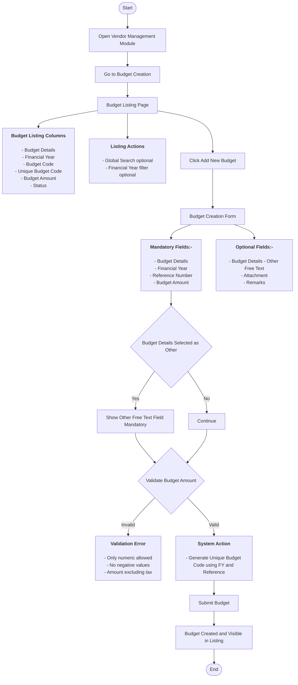

## 02_budget_approval_workflow.md

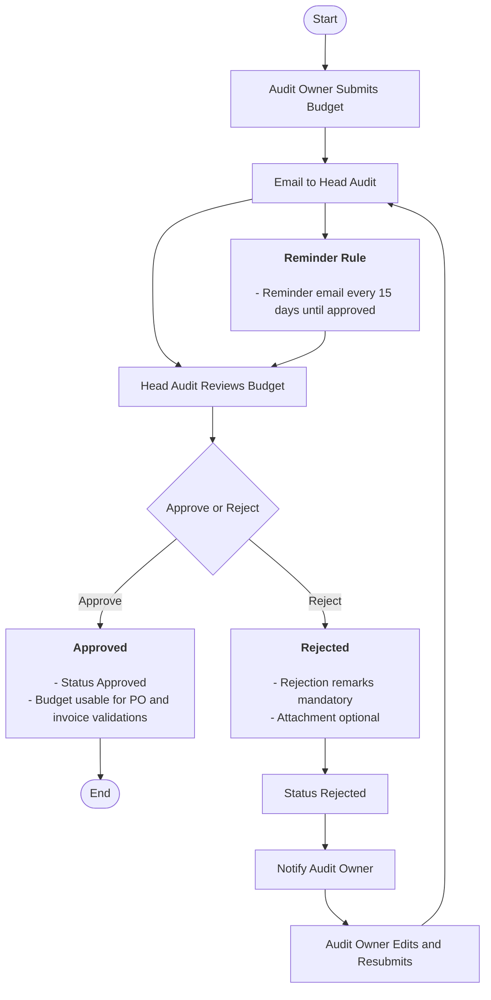

## 03_vendor_listing_and_creation.md

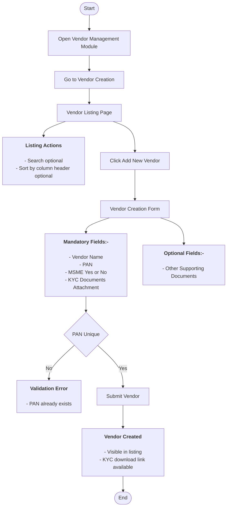

## 04_po_listing_and_creation.md

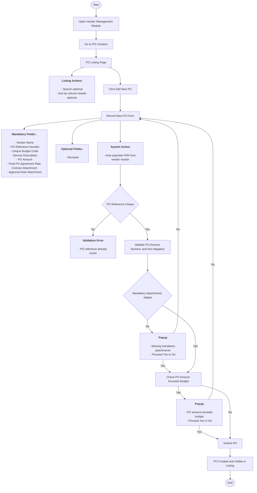

## 05_po_approval_and_status_logic.md

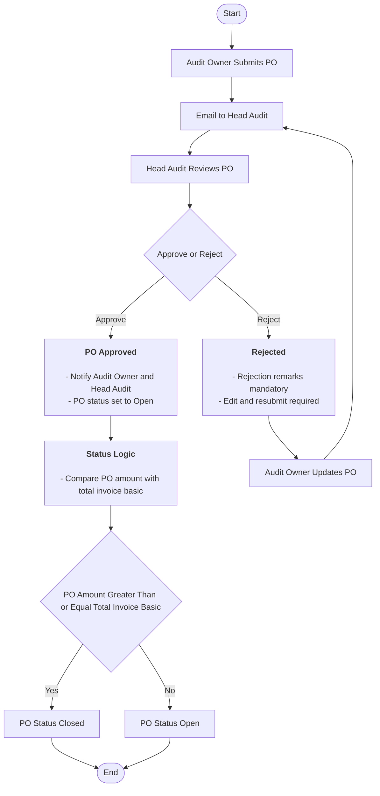

## 06_po_short_closure_workflow.md

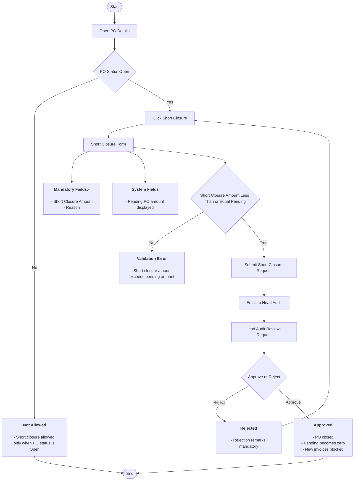

## 07_invoice_listing_and_recording.md

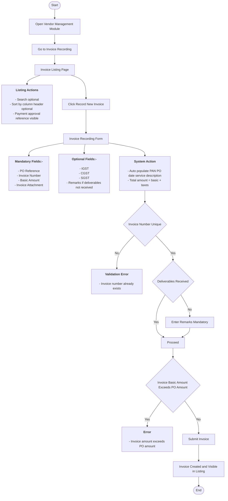

## 08_invoice_approval_and_payment_reference.md

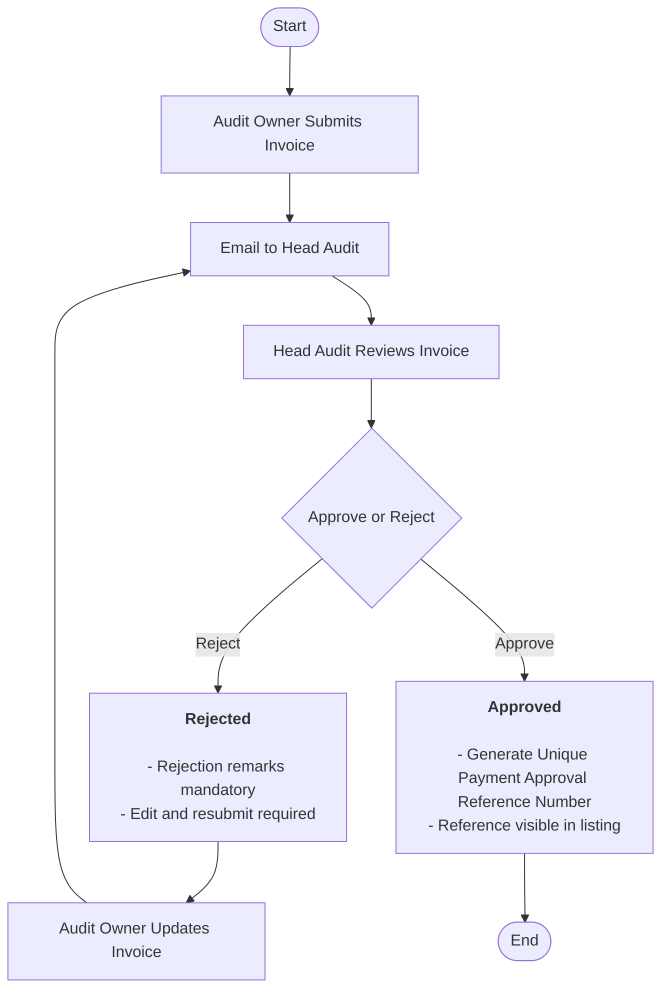

## 09_payment_top_sheet_flow.md

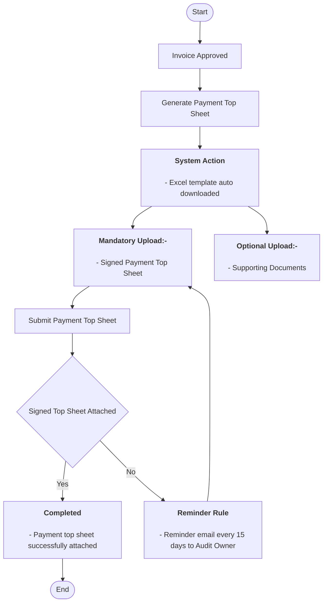

## 10_budget_vs_po_view.md

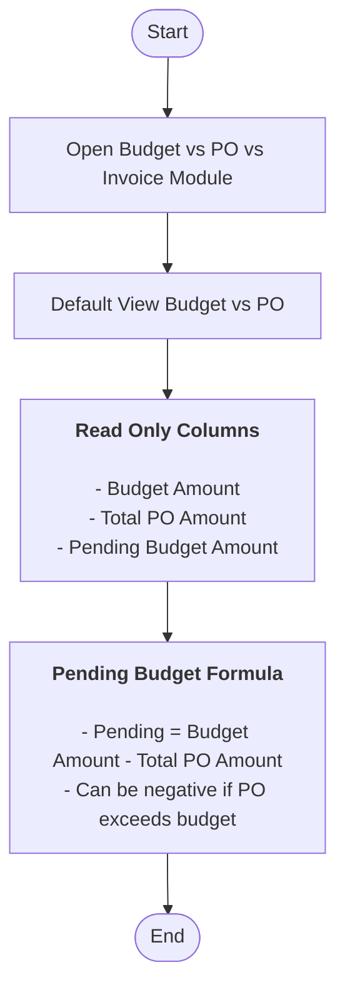

## 11_po_vs_invoice_view_and_drilldown.md

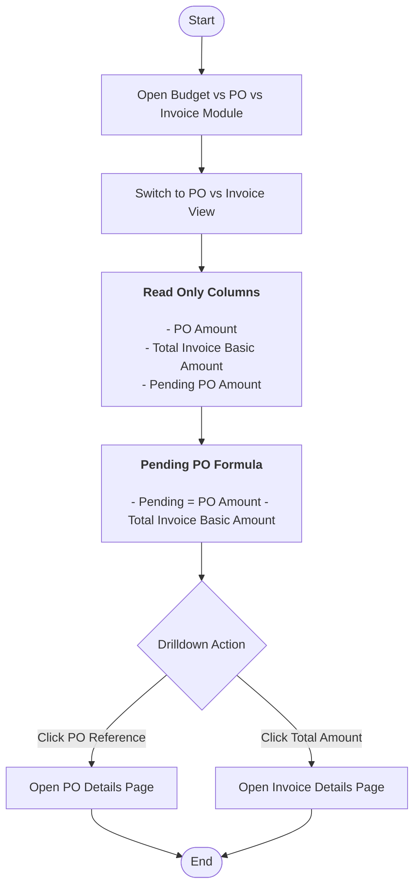

## 99_vendor_management_full_end_to_end.md

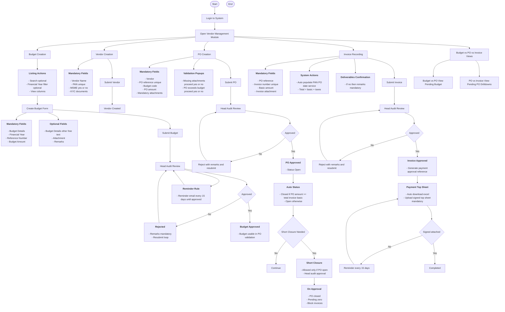

